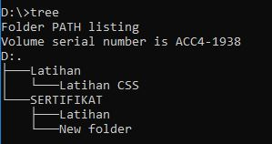
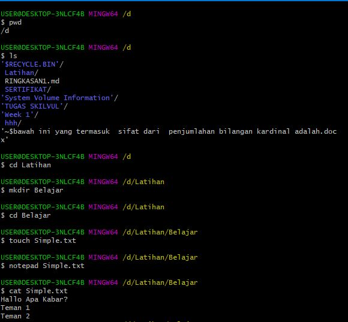
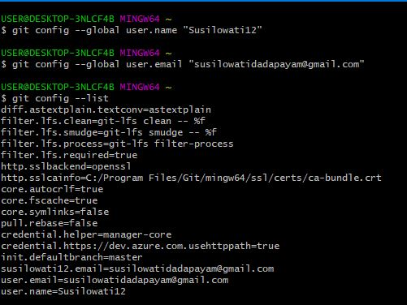
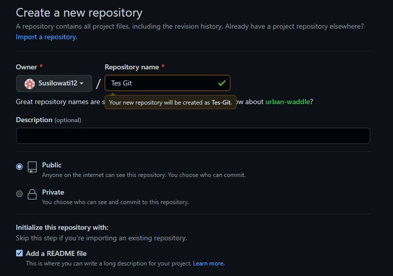
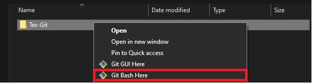
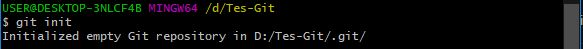
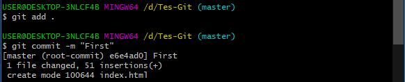
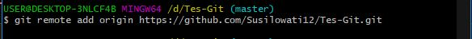
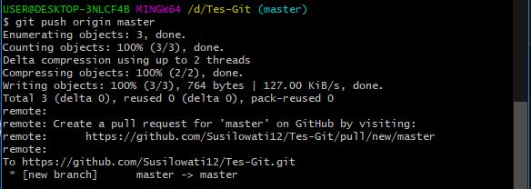
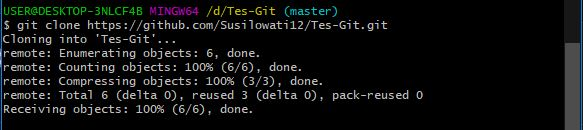

# Rangkuman Week 1

## Day 1 : Unix Command Line 
1. Aplikasi berdasarkan tampilan dibagi menjadi 2 yaitu :
>- GUI
>- CLI

2. Adapun CLI adalah Shell yang berbasis teks. 
3. __Shell__ yaitu program yang menerima perintah, kemudian meneruskan perintah tersebut ke sistem operasi untuk dieksekusi.
4. Untuk mengkases CLI dan terminal user dapat menggunakan Command Prompt terminal basic dari windows atau bisa juga menggunakan Git Bash yang sudah diinstall terlebih dahulu. Cara membukanya yaitu ketikkan pada kolom search di komputer kemudian double klik atau open program jika sudah ditemukan.
5. File system structure mengatur bagaimana data disimpan di dalam sebuah system. Contoh dalam Sistem Operasi Windows struktur file yang disimpan menggunakan struktur yang bentuknya mirip sebuah pohon seperti gambar dibawah.

&nbsp;&nbsp;&nbsp;&nbsp;&nbsp;&nbsp;&nbsp;&nbsp;&nbsp;

6. Command untuk navigasi, manipulasi file dan direktori menggunakan CLI antara lain :
>- pwd _(print working directory)_ : untuk melihat current working directory
>- ls : untuk melihat isi file yang ada di sebuah direktori
>- cd direktori : untuk berpindah direktori
>- mkdir : Untuk membuat direktori baru
>- touch : Untuk membuat file baru di dalam direktori
>- cat : Untuk melihat isi sebuah file
>- cp : Untuk menyalin file
>- mv : Untuk memindahkan dan merename file atau direktori
>- rm : menghapus file
>- rm-rf : menghapus direktori

&nbsp;&nbsp;&nbsp;&nbsp;&nbsp;&nbsp;&nbsp;&nbsp;&nbsp;

## GIT DAN GITHUB
- ### Perbedaan Git dan Github

  - __Git__ adalah aplikasi yang dapat melacaks suatu perubahan yang terjadi di suatu folder ataupun file, yang biasanya digunakan oleh programmer sebagai tempat untuk menyimpan file programan mereka karena lebih efektif. 
  - __Github__ adalah vendor penyedia layanan git yang dimiliki oleh microsoft atau secara definisi merupakan layanan hosting berbasis web sebagai repositori git.
- ### Mengapa Git dan Github Tools Yang Wajib Digunakan ?
  
Programmer dapat merencanakan suatu kegiatan dan menetapkan pekerjaan kepada anggota tim. Jadwal dapat diatur sendiri dan ini semua diperoleh dari Git dan/atau GitHub.Platform ini memungkinkan programmer dalam mengubah kode secara otomatis. Hal tersebut dapat menghemat waktu bagi programmer untuk menyusun dan mengubah sebuah kode.Selain itu,bisa mengerjakan kode secara offline dan online dengan fitur push atau pull dalam transfer commit.

- ### Alur Kerja dari Git dan Github
  
Dalam alur kerjanya, GitHub digunakan untuk menyimpan file yang dikerjakan. Caranya adalah dengan membuat commit dan mendorongnya masuk GitHub melalui Git, Kemudian programmer juga bisa menarik file tersebut dari GitHub menggunakan pull di Git.
  Secara detailnya yaitu :

  ### 1.  Login Git

  Masukkan username dan Email yang terdaftar di GitHub.Langkah ini cukup dilakukan satu kali.
  &nbsp;&nbsp;&nbsp;&nbsp;&nbsp;&nbsp;&nbsp;&nbsp;&nbsp;
  

  ### 2. Login dan buat repository baru di Github
  Setelah berhasil login ke GitHub, Anda bisa mulai membuat repository. Klik tombol New pada menu Repositories untuk membuat repository baru.

  &nbsp;&nbsp;&nbsp;&nbsp;&nbsp;&nbsp;&nbsp;&nbsp;&nbsp;
  

  ### 3. Buat folder di windows dan buka dengan Git Bash
  Selanjutnya,  membuat folder pada local disk komputer. Fungsinya adalah untuk menyimpan update file dari repository GitHub yang telah Anda buat. Kemudian klik kanan folder tersebut dan pilih git bash here.
  &nbsp;&nbsp;&nbsp;&nbsp;&nbsp;&nbsp;&nbsp;&nbsp;&nbsp;
  

  ### 4. Ubah Folder Menjadi Repository
  Setelah itu, ubah folder tersebut menjadi repository menggunakan perintah berikut:
    &nbsp;&nbsp;&nbsp;&nbsp;&nbsp;&nbsp;&nbsp;&nbsp;&nbsp;
    

  ### 5. Add File dan Commit ke Repository
  Ketikkan perintah git add kemudian dilanjutkan dengan git commit untuk menambahkan file dan menyimpan perubahan ke repository. Dan kita bisa menambahkan pesan untuk membeikan checkout pada setiap perbuahan. contohnya "git commit -m "First".
    &nbsp;&nbsp;&nbsp;&nbsp;&nbsp;&nbsp;&nbsp;&nbsp;&nbsp;
    

   ### 6. Remote Repository Github
  Remote repository berfungsi untuk mengupload file yang telah buat sebelumnya di local disk.
  &nbsp;&nbsp;&nbsp;&nbsp;&nbsp;&nbsp;&nbsp;&nbsp;&nbsp;
  

  ###  7. Push ke GitHub
  Langkah terakhir adalah push ke GitHub Push ini berfungsi untuk mempublish file atau aplikasi ke github.
  &nbsp;&nbsp;&nbsp;&nbsp;&nbsp;&nbsp;&nbsp;&nbsp;&nbsp;
  

   ### 8. Clone ke GitHub
  untuk melakukan cloning dari github ke komputer atau local
  &nbsp;&nbsp;&nbsp;&nbsp;&nbsp;&nbsp;&nbsp;&nbsp;&nbsp;
  

    

