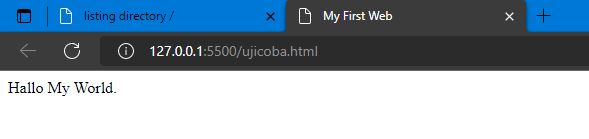
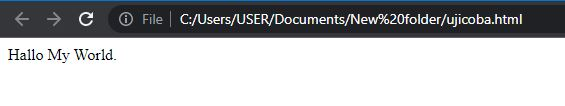
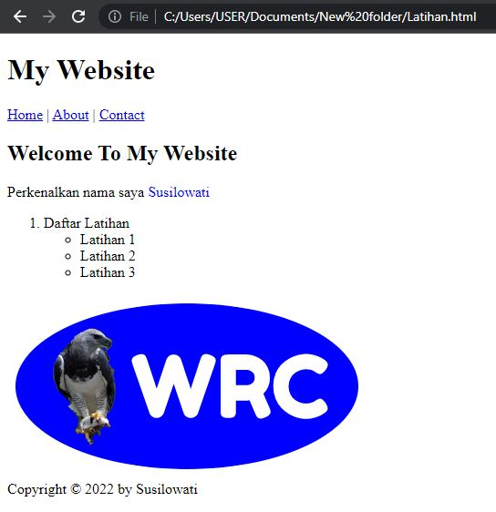
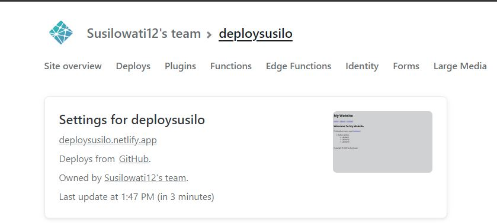
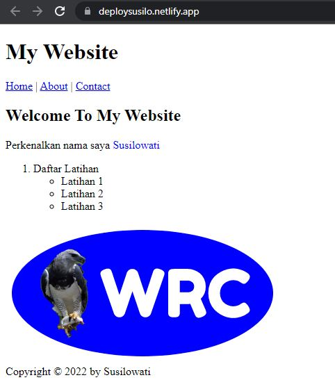
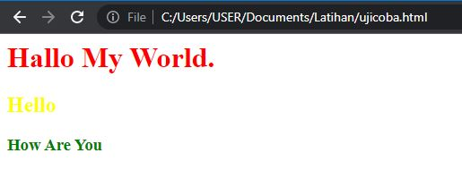
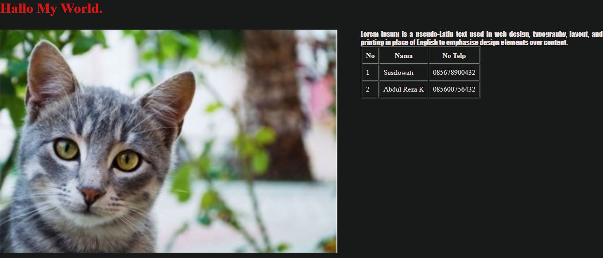
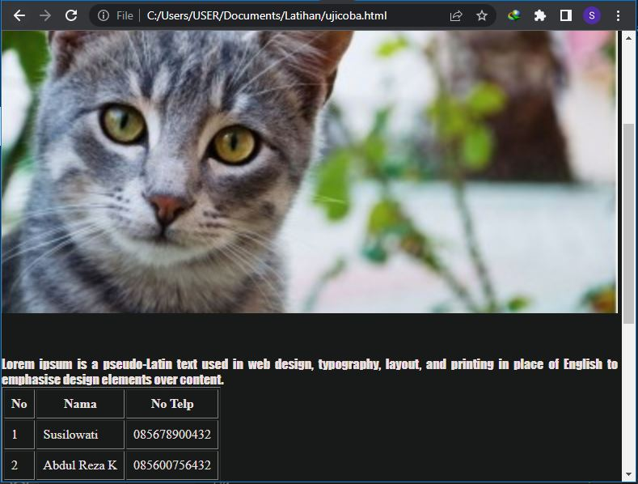

# Rangkuman Week 1

## Day 1 : Unix Command Line 
1. Aplikasi berdasarkan tampilan dibagi menjadi 2 yaitu :
>- GUI
>- CLI

2. Adapun CLI adalah Shell yang berbasis teks. 
3. __Shell__ yaitu program yang menerima perintah, kemudian meneruskan perintah tersebut ke sistem operasi untuk dieksekusi.
4. Untuk mengkases CLI dan terminal user dapat menggunakan Command Prompt terminal basic dari windows atau bisa juga menggunakan Git Bash yang sudah diinstall terlebih dahulu. Cara membukanya yaitu ketikkan pada kolom search di komputer kemudian double klik atau open program jika sudah ditemukan.
5. File system structure mengatur bagaimana data disimpan di dalam sebuah system. Contoh dalam Sistem Operasi Windows struktur file yang disimpan menggunakan struktur yang bentuknya mirip sebuah pohon seperti gambar dibawah.

&nbsp;&nbsp;&nbsp;&nbsp;&nbsp;&nbsp;&nbsp;&nbsp;&nbsp;


6. Command untuk navigasi, manipulasi file dan direktori menggunakan CLI antara lain :
>- pwd _(print working directory)_ : untuk melihat current working directory
>- ls : untuk melihat isi file yang ada di sebuah direktori
>- cd direktori : untuk berpindah direktori
>- mkdir : Untuk membuat direktori baru
>- touch : Untuk membuat file baru di dalam direktori
>- cat : Untuk melihat isi sebuah file
>- cp : Untuk menyalin file
>- mv : Untuk memindahkan dan merename file atau direktori
>- rm : menghapus file
>- rm-rf : menghapus direktori

&nbsp;&nbsp;&nbsp;&nbsp;&nbsp;&nbsp;&nbsp;&nbsp;&nbsp;


## GIT DAN GITHUB
- ### Perbedaan Git dan Github

  - __Git__ adalah aplikasi yang dapat melacaks suatu perubahan yang terjadi di suatu folder ataupun file, yang biasanya digunakan oleh programmer sebagai tempat untuk menyimpan file programan mereka karena lebih efektif. 
  - __Github__ adalah vendor penyedia layanan git yang dimiliki oleh microsoft atau secara definisi merupakan layanan hosting berbasis web sebagai repositori git.
- ### Mengapa Git dan Github Tools Yang Wajib Digunakan ?
  <div align="justify">Programmer dapat merencanakan suatu kegiatan dan menetapkan pekerjaan kepada anggota tim. Jadwal dapat diatur sendiri dan ini semua diperoleh dari Git dan/atau GitHub.Platform ini memungkinkan programmer dalam mengubah kode secara otomatis. Hal tersebut dapat menghemat waktu bagi programmer untuk menyusun dan mengubah sebuah kode.Selain itu,bisa mengerjakan kode secara offline dan online dengan fitur push atau pull dalam transfer commit.

- ### Alur Kerja dari Git dan Github
  <div align="justify">Dalam alur kerjanya, GitHub digunakan untuk menyimpan file yang dikerjakan. Caranya adalah dengan membuat commit dan mendorongnya masuk GitHub melalui Git, Kemudian programmer juga bisa menarik file tersebut dari GitHub menggunakan pull di Git.
  Secara detailnya yaitu :

  ### 1.  Login Git

  Masukkan username dan Email yang terdaftar di GitHub.Langkah ini cukup dilakukan satu kali.

  &nbsp;&nbsp;&nbsp;&nbsp;&nbsp;&nbsp;&nbsp;&nbsp;&nbsp;
  

  ### 2. Login dan buat repository baru di Github
  Setelah berhasil login ke GitHub, Anda bisa mulai membuat repository. Klik tombol New pada menu Repositories untuk membuat repository baru.

  &nbsp;&nbsp;&nbsp;&nbsp;&nbsp;&nbsp;&nbsp;&nbsp;&nbsp;
  

  ### 3. Buat folder di windows dan buka dengan Git Bash
  Selanjutnya,  membuat folder pada local disk komputer. Fungsinya adalah untuk menyimpan update file dari repository GitHub yang telah Anda buat. Kemudian klik kanan folder tersebut dan pilih git bash here.

  &nbsp;&nbsp;&nbsp;&nbsp;&nbsp;&nbsp;&nbsp;&nbsp;&nbsp;
  

  ### 4. Ubah Folder Menjadi Repository
  Setelah itu, ubah folder tersebut menjadi repository menggunakan perintah berikut:

    &nbsp;&nbsp;&nbsp;&nbsp;&nbsp;&nbsp;&nbsp;&nbsp;&nbsp;
    

  ### 5. Add File dan Commit ke Repository
  Ketikkan perintah git add kemudian dilanjutkan dengan git commit untuk menambahkan file dan menyimpan perubahan ke repository. Dan kita bisa menambahkan pesan untuk membeikan checkout pada setiap perbuahan. contohnya "git commit -m "First".

    &nbsp;&nbsp;&nbsp;&nbsp;&nbsp;&nbsp;&nbsp;&nbsp;&nbsp;
    

   ### 6. Remote Repository Github
  Remote repository berfungsi untuk mengupload file yang telah buat sebelumnya di local disk.
  
  &nbsp;&nbsp;&nbsp;&nbsp;&nbsp;&nbsp;&nbsp;&nbsp;&nbsp;
  

  ###  7. Push ke GitHub
  Langkah terakhir adalah push ke GitHub Push ini berfungsi untuk mempublish file atau aplikasi ke github.

  &nbsp;&nbsp;&nbsp;&nbsp;&nbsp;&nbsp;&nbsp;&nbsp;&nbsp;
  

   ### 8. Clone ke GitHub
  untuk melakukan cloning dari github ke komputer atau local

  &nbsp;&nbsp;&nbsp;&nbsp;&nbsp;&nbsp;&nbsp;&nbsp;&nbsp;
  

## Day 2 : HTML
- ### Pengertian HTML

   HTML adalah singkatan dari _Hypertext Markup Language_. Secara singkat HTML adalah kerangka dari sebuat website yang mana biasanya digunakan untuk  menampilkan konten pada browser. 

   Bagaimana peran HTML pada web development? 
   HTML memastikan format teks dan gambar yang tepat untuk browser Internet.Web browser seperti Chrome, Firefox, Edge, Safari, atau Opera akan membaca dokumen HTML.Tanpa HTML, browser tidak akan tahu bagaimana menampilkan teks sebagai elemen atau memuat gambar atau elemen lainnya. 

   Ada 2 tools utama yang harus dipersiapkan untuk membuat HTML

   - Browser
   - Code Editor
- ### Kode HTML Sederhana dan Cara Menjalankannya
  ```html
  <html>
  <head>
  <title>
      My First Web
  </title>
  <body>
      Hallo My World.
  </body>
  </html>
  ```

  Pada kode program di atas terlihat struktur dari html terdiri dari tag html,head dan body. Di dalam tag head saya memasukkan title yang nantinya akan ditampilkan di bagian title bar saat kode ini dibuka oleh browser.Selanjutnya untuk konten akan selalu di masukkan ke dalam tag body. Maka tampilan dari file html ini akan terlihat seperti gambar di bawah ini :
  
   &nbsp;&nbsp;&nbsp;&nbsp;&nbsp;&nbsp;&nbsp;&nbsp;&nbsp;&nbsp;
  

  Di tampilan di atas saya menggunakan ekstensi __live server__ yang sudah saya install terlebih dahulu.Adapun kelebihanya yaitu tampilan di browser akan otomatis terefresh setiap programmer save perubahan pada kode html yang dibuat tanpa mengklik tombol refresh.
  Cara menggunakan live server : Klik open folder lalu pilih file html kemudian klik Go Live.

  Adapun jika secara manual maka tampilannya akan seperti di bawah ini :

  &nbsp;&nbsp;&nbsp;&nbsp;&nbsp;&nbsp;&nbsp;&nbsp;&nbsp;&nbsp;
  
- ### Semantic HTML dan Tag yang ada di dalam HTML
  Semantic HTML yaitu menggunakan elemen HTML sesuai dengan kebutuhan konten. Contoh yaitu header, footer, nav, section, aside, dll.

  Di dalam HTML juga terdapat istilah single tag (tag yang tidak memiliki pasangan penutup) dan double tag (tag yang memiliki pasangan penutup).

```
<!DOCTYPE html>
<head>
    <title>Document</title>
</head>
<body>
    <body>

        <header>
          <h1>My Website</h1>
        </header>
      
        <nav>
          <a href="#">Home</a> |
          <a href="#">About</a> |
          <a href="#">Contact</a>
        </nav>
      
        <article>
          <h1>Welcome To My Website</h1>
          <p>Perkenalkan nama saya <span style ="color:blue"; > Susilowati </span>
          </p>
          <ol type ="1">
            <li>Daftar Latihan</li>
            <ul>
                <li>Latihan 1</li>
                <li>Latihan 2</li>
                <li>Latihan 3</li>
            </ul>
           
          </ol>
          </img>
        </article>
      
        <footer>
          Copyright &copy; 2022 by Susilowati
        </footer>
      
      </body>
</body>
</html>
```
Tag - tag yang digunakan :
>- Tag h1 : Digunakan untuk membuat heading
>- Tag p: Digunakan untuk membuat paragraf
>- Tag a href : Digunakan untuk membuat tulisan dengan link
>- Tag ol (ordered list): Digunakan untuk membuat list yang terurut
>- Tag ul (unordered list): Digunakan untuk membuat list yang tidak terurut
>- Tag img: Digunakan untuk menampilkan gambar.

output :

&nbsp;&nbsp;&nbsp;&nbsp;&nbsp;&nbsp;&nbsp;&nbsp;&nbsp;&nbsp;
  
  
- ### Deploy HTML
  Deploy adalah sebuah proses untuk menyebarkan aplikasi yang sudah kita kerjakan supaya bisa diakses secara publik. Jika aplikasi kita HTML atau Web App kita perlu mendeploy ke server. Untuk melakukan hal tersebut kita bisa menggunakan layanan yang bernama Netlify.

  Berikut tampilan jika berhasil mendeploy website Netlify.

  &nbsp;&nbsp;&nbsp;&nbsp;&nbsp;&nbsp;&nbsp;&nbsp;&nbsp;&nbsp;
  
  &nbsp;&nbsp;&nbsp;&nbsp;&nbsp;&nbsp;&nbsp;&nbsp;&nbsp;&nbsp;

  

## Day 3 : CSS
- ### Pengertian CSS
  CSS adalah bahasa komputer yang digunakan untuk menambahkan design ke suatu halaman website di internet agar terlihat lebih cantik/menarik. CSS adalah singkatan dari Cascading Style Sheets. Kita ibaratkan HTML adalah kerangka yang memberi sturuktur pada website, maka CSS adalah baju yang memberi warna dan layout pada website.
  
- ### Cara penggunaan CSS
  - Inline CSS
    
    Programmer menambahkan langsung ke elemen html di baris kode html yang akan diberikan style.
  - Internal CSS
    
    menggunakan element/tag `<style>` untuk menyisipkan kode CSS. element/tag `<style>` diletakkan di dalam element `<head>`
  - Eksternal CSS

    menyisipkan kode CSS dengan cara membuat file CSS terpisah, dan lalu menyambungkannya dengan file HTML dengan menggunakan element `<link>`. Element `<link>` tersebut diletakkan di dalam element `<head>`

    Kode program
    ```
    <!-- File index.html -->
    <html>
    <head>
      <title>
        My First Web
      </title>
      <style>
        h2{
        color:yellow;
        }
      </style>
      <link rel="stylesheet" href="styles.css" />
    <body>
       <!-- Ini inline CSS -->
       <h1 style="color:red">Hallo My World.</h1> 
       <!-- Ini internal CSS -->
       <h2>Hello</h2>
       <!-- Ini eksternal CSS -->
       <h3>How Are You</h3>
    </body>
    </html>
    ```
   ```
   /* File styles.css */
   h3{
    color:green;
    }
    ```

    Output

    &nbsp;&nbsp;&nbsp;&nbsp;&nbsp;&nbsp;&nbsp;&nbsp;&nbsp;&nbsp;
  

- ### CSS Syntax
  CSS Syntax adalah syntax yang digunakan untuk menunjuk atau memilih HTML element mana yang ingin diberi style (dihias). CSS syntax terdiri dari selector, property, dan value.

  Syntaxnya seperti ini:
  ```css
  h3 {
    color: green;
  }
  ```

  Penjelasan :

  - h3

    Adalah sebuah selector berupa element HTML yang akan diubah

  - color

    <div align="justify">Adalah sebuah properti berupa bagian mana dari element HTML yang akan diubah. Contoh diatas kita akan mengubah warna dari teks yang ada di element h3

  - green

    Adalah value yaitu nilai/hiasan berupa warna hijau

  &nbsp;
- ### Styling CSS Sederhana
  Kode program
```
  <!-- File index.html -->
<html>
<head>
<title>
    My First Web
</title>
<link rel="stylesheet" href="styles.css" />
<body>
    <header>
        <h1 >Hallo My World.</h1> 
    </header>
    <div class="container">
    <div class="left">
        
    </div>
    <div class="right">
        <p> Lorem ipsum is a pseudo-Latin text used in web design, typography, layout, and printing in place of English to emphasise design elements over content. 
        </p>
        <table border="1" cellpadding="8">
            <tr>
                <th>No</th>
                <th>Nama</th>
                <th>No Telp</th>
            </tr>
            <tr>
                <td>1</td>
                <td>Susilowati</td>
                <td>085678900432</td>
            </tr>
            <tr>
                <td>2</td>
                <td>Abdul Reza K</td>
                <td>085600756432</td>
            </tr>
        </table>
    </div>
    </div>
</body>
</html>

```

```
  /* File styles.css */
*{
    margin : 0px;
    background-color: rgb(24, 26, 25);
    color:rgb(235, 224, 224)
}
header h1{
    color:rgb(226, 19, 19)
}
.container{
    display: flex;
    flex-wrap: wrap;
    margin-top: 30px;
    justify-content: space-between ;
}
.left{
    width: 50%;
}
.right{
    width: 40%;
    margin-right: 5%;
}
p{
    text-align: justify ;
    font-family: Impact, Haettenschweiler, 'Arial Narrow Bold', sans-serif;
}
@media (max-width: 800px) {
    .left , .right {
        width :100%;
    }
  }

```
Output :

&nbsp;&nbsp;&nbsp;&nbsp;&nbsp;&nbsp;&nbsp;&nbsp;&nbsp;&nbsp;
  

&nbsp;&nbsp;&nbsp;&nbsp;&nbsp;&nbsp;&nbsp;&nbsp;&nbsp;&nbsp;
  

Penjelasan :

  - ` * `

    <div align="justify">Adalah sebuah selector untuk keseluruhan element HTML yang di default ulang dengan properti margin : 0px,Kemudian warna background-color: rgb(24, 26, 25); dan warna tulisan yaitu color:rgb(235, 224, 224)

  - header h1

    <div align="justify">Adalah sebuah selector dengan elemen header sebagai parent dan h1 sebagai child dari header.Disini saya memberikan properti untuk h1 dengan warna tulisan yaitu color :rgb(226, 19, 19) 

  - .container

    <div align="justify">adalah sebuah selector berupa class bernama container.Di container ini saya membuat wadah untuk website dengan menerapkan penggunaan flexbox.Saya memberikan properti 
    display: flex;
    flex-wrap: wrap;
    margin-top: 30px;
    justify-content: space-between ;
- .left

    <div align="justify">adalah sebuah selector berupa class bernama left.Ini untuk mengatur flexbox di bagian pertama. Di left ini memberikan properti width :50%.

- .right

    <div align="justify">adalah sebuah selector berupa class bernama right.Ini untuk mengatur flexbox di bagian selanjutnya. Di right ini memberikan properti width :40% dan margin right:5%.

- p

    <div align="justify">Adalah sebuah selector untuk semua elemen p diberikan styling css text-align: justify dan 
    font-family: Impact, Haettenschweiler, 'Arial Narrow Bold', sans-serif.

- @media (max-width: 800px)

  <div align="justify">media query untuk membuat responsive website apabila tampilan website dengan lebar maksimal 800px maka akan distyling .left dan .right akan mempunyai nilai width :100%. 
    
 


  


    


    


