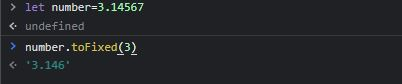

# Rangkuman Week 2

## JavaScript Dasar

- Looping JavaScript

    <div align="justify">suatu metode dalam pemrograman untuk meng eksekusi suatu berintah yang sama terus-menerus hingga kondisi tertentu terpenuhi.

    - __For Loop__

    <div align="justify">digunakan jika kita tahu pasti seberapa banyak pengulangan yang ingin dilakukan pada program yang akan dikembangkan

    &nbsp;&nbsp;&nbsp;&nbsp;&nbsp;&nbsp;&nbsp;&nbsp;&nbsp;&nbsp;

    

    - __While__


    <div align="justify">Jenis perulangan ini akan menanyakan apakah kondisi terpenuhi terlebih dahulu jika true maka baru akan menjalankan instruksi perulangan.

    &nbsp;&nbsp;&nbsp;&nbsp;&nbsp;&nbsp;&nbsp;&nbsp;&nbsp;&nbsp;

    

    - __do While__

    <div align="justify">Jenis perulangan ini akan menjalankan instruksi perulangan terlebih dahulu  baru akan menanyakan apakah kondisi terpenuhi atau tidak.

    &nbsp;&nbsp;&nbsp;&nbsp;&nbsp;&nbsp;&nbsp;&nbsp;&nbsp;&nbsp;

    

- Scope

    <div align="justify">Scope adalah konsep dalam flow data variabel.Ada dua jenis di dalam scope yaitu :

    - __Global Scope__


    <div align="justify">Berarti variabel yang kita buat dapat diakses dimanapun dalam suatu file.Agar menjadi Global Scope, suatu variabel harus dideklarasikan diluar Blocks.

    &nbsp;&nbsp;&nbsp;&nbsp;&nbsp;&nbsp;&nbsp;&nbsp;&nbsp;&nbsp;

    

    - __Local Scope__


    <div align="justify">Berarti kita mendeklarasikan variabel didalam blocks.Maka variabel hanya bisa diakses didalam blocks saja. Tidak bisa diakses diluar blocks.

    &nbsp;&nbsp;&nbsp;&nbsp;&nbsp;&nbsp;&nbsp;&nbsp;&nbsp;&nbsp;

    

- Function

  - __Definisi Function__

  <div align="justify">sebuah blok kode dalam sebuah grup untuk menyelesaikan 1 task/1 fitur. Saat kita membutuhkan fitur tersebut nantinya, kita bisa kembali menggunakannya.

  - __Membuat Function__

  <div align="justify">Untuk membuat function kita dapat membuat script seperti gambar di bawah ini:

  &nbsp;&nbsp;&nbsp;&nbsp;&nbsp;&nbsp;&nbsp;&nbsp;&nbsp;&nbsp;

  

  Example :

  &nbsp;&nbsp;&nbsp;&nbsp;&nbsp;&nbsp;&nbsp;&nbsp;&nbsp;&nbsp;

  


   - __Memanggil Function__

  <div align="justify">Untuk memanggil function kita dapat membuat script seperti  di bawah ini:

  ```
  nameFunction()
  ```

  &nbsp;&nbsp;&nbsp;&nbsp;&nbsp;&nbsp;&nbsp;&nbsp;&nbsp;&nbsp;

  

  - __Parameter dan Argumen__

    - Parameter

       - <div align="justify">Dengan parameter, function dapat menerima sebuah inputan data dan menggunakannya untuk melakukan task/tugas.

       - <div align="justify">Saat membuat function/fitur, kita harus tahu data-data yang dibutuhkan. Misalnya saat membuat function penambahan 2 buah nilai. Data yang dibutuhkan adalah 2 buah nilai tersebut.

   - Argumen

       - <div align="justify">Argumen adalah nilai yang digunakan saat memanggil function.

       - <div align="justify">Jumlah argumen harus sama dengan jumlah parameternya

       - <div align="justify">Jadi jika di function penambahan ada 2 parameter nilai saat membuat function. Saat memanggil function kita gunakan 2 buah nilai argumen.

    Snytax Parameter dan Argumen:

    &nbsp;&nbsp;&nbsp;&nbsp;&nbsp;&nbsp;&nbsp;&nbsp;&nbsp;&nbsp;

    
    
    Example:

    &nbsp;&nbsp;&nbsp;&nbsp;&nbsp;&nbsp;&nbsp;&nbsp;&nbsp;&nbsp;

    

  - __Default Parameters__
    
    <div align="justify">Default paramaters digunakan untuk memberikan nilai awal/default pada parameter function.
 
    Example:

    &nbsp;&nbsp;&nbsp;&nbsp;&nbsp;&nbsp;&nbsp;&nbsp;&nbsp;&nbsp;

    

  - __Function Helper__
    
    Kita bisa menggunakan function yang sudah dibuat pada function lain.

    Example:

    &nbsp;&nbsp;&nbsp;&nbsp;&nbsp;&nbsp;&nbsp;&nbsp;&nbsp;&nbsp;
    

  - __Arrow Function__

    <div align="justify">Arrow function adalah cara lain menuliskan function. Ini adalah fitur terbaru yang ada pada ES6 (Javascript Version). Syntax arrow function :

    let myFunction = (kondisi) => { }

    Example:

    &nbsp;&nbsp;&nbsp;&nbsp;&nbsp;&nbsp;&nbsp;&nbsp;&nbsp;&nbsp;
    

- Jenis Kesalahan

<div align="justify"> Errorobjek dilempar ketika kesalahan runtime terjadi. Objek Error juga dapat digunakan sebagai objek dasar untuk pengecualian yang ditentukan pengguna. Lihat di bawah untuk jenis kesalahan bawaan standar. 

<div align="justify">Selain konstruktor generik Error, ada konstruktor kesalahan inti lainnya dalam JavaScript. 

 - EvalError

<div align="justify">Membuat instance yang mewakili kesalahan yang terjadi terkait fungsi global eval().

- RangeError

<div align="justify">Membuat instance yang mewakili kesalahan yang terjadi saat variabel numerik atau parameter berada di luar rentang validnya.

- ReferenceError

<div align="justify">Membuat instance yang mewakili kesalahan yang terjadi saat mereferensikan referensi yang tidak valid.

- SyntaxError

<div align="justify">Membuat instance yang mewakili kesalahan sintaks.

- TypeError

<div align="justify">Membuat instance yang mewakili kesalahan yang terjadi saat variabel atau parameter bukan tipe yang valid.

- URIError

<div align="justify">Membuat instance yang mewakili kesalahan yang terjadi saat encodeURI()atau decodeURI()melewati parameter yang tidak valid.

- AggregateError

<div align="justify">Membuat instance yang mewakili beberapa kesalahan yang dibungkus dalam satu kesalahan ketika beberapa kesalahan perlu dilaporkan oleh suatu operasi, misalnya oleh Promise.any().

- InternalError Tidak standar

<div align="justify">Membuat instance yang mewakili kesalahan yang terjadi saat kesalahan internal di mesin JavaScript dilemparkan. Misalnya "terlalu banyak rekursi".


## Data Type Built in Prototype

- __Java Script__ memiliki 2 tipe data yaitu:
   
   - Primitive (boleean, string, number, null,undefined)

   - Non primitive(object)

- __Operator TypeOf__ digunakan untuk mengecek tipe data.

Example:

&nbsp;&nbsp;&nbsp;&nbsp;&nbsp;&nbsp;&nbsp;&nbsp;&nbsp;&nbsp;


- __Properti Tipe Data String__

  - Length

    Untuk mengecek jumlah karakter dalam string.

    Example:

    &nbsp;&nbsp;&nbsp;&nbsp;&nbsp;&nbsp;&nbsp;&nbsp;&nbsp;&nbsp;

    

- __Method Tipe Data String__
  - toUpperCase()
    
    Untuk mengubah string menjadi huruf kapital semua.
    
    Example:

    &nbsp;&nbsp;&nbsp;&nbsp;&nbsp;&nbsp;&nbsp;&nbsp;&nbsp;&nbsp;

    

  - toLowerCase()
    
    Untuk mengubah string menjadi huruf besar semua.
    
    Example:

    &nbsp;&nbsp;&nbsp;&nbsp;&nbsp;&nbsp;&nbsp;&nbsp;&nbsp;&nbsp;

    

  - CharAt()
    
    Untuk mengembalikan sebuah karakter berdasrkan index yang sudah ditentukan.
    
    Example:

    &nbsp;&nbsp;&nbsp;&nbsp;&nbsp;&nbsp;&nbsp;&nbsp;&nbsp;&nbsp;

    

   - includes()
    
     Untuk melakukan pencarian,jika ditemukan maka bernilai true jika tidak bernilai false.
    
     Example:

     &nbsp;&nbsp;&nbsp;&nbsp;&nbsp;&nbsp;&nbsp;&nbsp;&nbsp;&nbsp;

     

   - split()
    
     Untuk memisahkan string dalam bentuk data array dengan sebuah pola.
    
     Example:

     &nbsp;&nbsp;&nbsp;&nbsp;&nbsp;&nbsp;&nbsp;&nbsp;&nbsp;&nbsp;

     

- __Method Tipe Data Number__ 
  
  - isNan()
    
     Untuk mengecek apakah sebuah data number atau bukan .
    
     Example:

     &nbsp;&nbsp;&nbsp;&nbsp;&nbsp;&nbsp;&nbsp;&nbsp;&nbsp;&nbsp;

     

  - toString()
    
     Untuk mengubah number menjadi string .
    
     Example:

     &nbsp;&nbsp;&nbsp;&nbsp;&nbsp;&nbsp;&nbsp;&nbsp;&nbsp;&nbsp;

     

   - toFixed()
    
     Untuk menentukan jumlah angka dibelakang koma .
    
     Example:

     &nbsp;&nbsp;&nbsp;&nbsp;&nbsp;&nbsp;&nbsp;&nbsp;&nbsp;&nbsp;

     

- __Properti  dan Method Math__
  
  - Properti Math.PI 
    
    Untuk mendapatkan nilai PI tanpa membuat variabel baru.

  - Method 
  
    - Math.pow() : Untuk mencari nilai pangkat.
    - Math.sqrt() : Untuk mencari nilai akar.
    - Math.round() : Untuk membulatkan bilangan desimal.

- __Method Date__
  
  - getDay(): Untuk mengambil data hari
  - getFullYear(): Untuk mengambil data tahun

- __Prototype__

  <div align="justify">Permasalahan :  membuat sebuat method baru yaitu reverse() pada tipe data String.

  <div align="justify"> Penyelesaian : Membuat method dengan menggunakan String.prototype.reverse().

  Example :

  &nbsp;&nbsp;&nbsp;&nbsp;&nbsp;&nbsp;&nbsp;&nbsp;&nbsp;&nbsp;

  

## DOM HTML

  - DOM Intro
   
    <div align="justify"> DOM merupakan jembatan supaya bahasa pemrograman dapat berinterkasi dengan dokumen HTML. Dengan DOM, Javascript dapat memanipulasi HTML.

   - Traversing DOM
      
     - __Traversing ke bawah__
       
       - getElementById() : Untuk memanggil elemen HTML berdasarkan id.

       - getElementsByClassName() : Untuk memanggil elemen HTML berdasarkan class.

       - getElementsByTagName() : Untuk memanggil elemen HTML berdasarkan tag.

       - querySelector() : Untuk memanggil elemen satu elemen HTML.

       - querySelectorAll() : Untuk memanggil elemen semua elemen HTML.

     - __Traversing ke atas__
       
       - parentElement() : Untuk memanggil parent dari elemen HTML yang dipilih.

       - closest() : Untuk memanggil leluhur dari elemen HTML yang dipilih.

     - __Traversing ke samping__
       
       - nextElementSibling() : Untuk memanggil adik dari elemen HTML yang dipilih.

       - previousElementSibling() : Untuk memanggil kakak dari elemen HTML yang dipilih.

       Example:

       &nbsp;&nbsp;&nbsp;&nbsp;&nbsp;&nbsp;&nbsp;&nbsp;&nbsp;&nbsp;

       

       Output:

       &nbsp;&nbsp;&nbsp;&nbsp;&nbsp;&nbsp;&nbsp;&nbsp;&nbsp;&nbsp;

       

  - DOM Manipulation
    
    - innerHTML= Untuk menambahkan content.
    - createElement()= Untuk membuat element baru.
    - appendChild()= Untuk menyisipkan child ke dalam parent.
    - remove() = Untuk menghapus elemen
    - attributes = Untuk menampilkan list atribut
    - getAttribute()= Untuk mengambil isi attribut.
    - setAttribute()= Untuk menambahkan attribut
    - style.color = Untuk mengatur style color pada elemen.
    - getComputedStyle()= Untuk mendapatkan style dari element.
    - classList = Untuk menampilkan list dari sebuah kelas.
    - classList.add = Untuk menambahkan class baru.
    - classList.remove = Untuk menghapus class.

    Example:

    &nbsp;&nbsp;&nbsp;&nbsp;&nbsp;&nbsp;&nbsp;&nbsp;&nbsp;&nbsp;

    

    Output:

    &nbsp;&nbsp;&nbsp;&nbsp;&nbsp;&nbsp;&nbsp;&nbsp;&nbsp;&nbsp;

    

  - DOM Events
   
    merupakan object model yang bertugas untuk membantu interaksi user dengan document HTML

     - Contoh HTML DOM events

        - Click
        - Scroll
        - Change
        - Focus
        - Hover
        - Submit
        - Blur

     - Menangkap Interaksi User
       
       - Element.onevent
       - Element.addEventListener("event)


         Dengan menggunakan Element.addEventListener ("event") dapat menerapkan beberapa hal yaitu :
            - Bisa dihilangkan
            - Bisa ada beberapa event listener yang sama untuk 1 element
            - Memiliki argument tambahan {options}

         Contoh EventListener :
           - EventListener - Click 

               `` <input id="user-input"/> ``
               `` <button id="alert-button">show</button> ``

             Memanggil element berdasarkan id

              `` const input = document.getElementById("user-input") ``
              `` const button = dosument.getElementById("alert-button") ``

              ```
              button.addEventListener("click", function()) {
              alert(input.value)
               } 
              ```
           - EventListener - Blur : event dimana sebuah element kehilangan fokus dari user 
             Contoh EventListener - Blur <br />

             Misalkan saat ingin memvalidasi isi dari ``<input id = "username" />`` agar panjangnya minimal 6 karakter

             `` const input = document.getElementById("username") ``

             ```
             input.addEventListener("blur", () => {
             if(input.value.length < 6) alert("Panjang username minimal 6")
              })
             ```
           - EventListener - Form Submission
              Contoh EvenListener - Form Submission <br />

              Misalkan terdapat beberapa input dalam sebuah form 
              `` <input name="email"/> `` dan ``<input type="password" name="password"/>`` <br />

             Untuk mendapatkan isi dari kedua inputan tersebut terdapat 2 cara :
              - Memasang event listener di kedua input dan tombol submit, lalu saat tombol diklik, baca value dari kedua input tersebut
              - Memasang event listener di form, lalu gunakan FormData untuk menggambil data dari masing-masing input

             
             ```
             const form = document.getElementById("form")

             form.addEventListener("submit", function(event)){
             event.preventDefault()

             const formData = new FormData(form)
             const values = Object.fromEntries(formData) {
             email: ....
              }
             })
             ```
            


       


    
  

 


