# JAVASCRIPT INTERMEDIATE

- ## Array

  - Pengertian Array
    
    <div align="justify">adalah tipe data list order yang dapat menyimpan tipe data apapun di dalamnya.Array dapat menyimpan tipe data String, Number, Boolean, dan lainnya.Array memiliki index.

   - Cara membuat dan memanggil array

     <div align="justify">Array didefinisikan dengan square brackets [] .Adapun cara memanggilnya yaitu dengan menuliskan nama array atau juga bisa ditambahkan angka index sesuai yang ingin ditampilkan.

     &nbsp;&nbsp;&nbsp;&nbsp;&nbsp;&nbsp;&nbsp;&nbsp;&nbsp;
     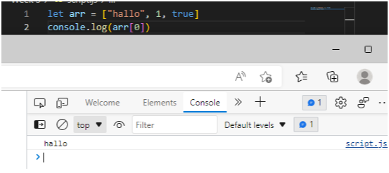

  - Update Array

    <div align="justify">Seperti tipe data dan variabel pada umumnya, kita dapat mengupdate data pada Array

    example:

    &nbsp;&nbsp;&nbsp;&nbsp;&nbsp;&nbsp;&nbsp;&nbsp;&nbsp;
    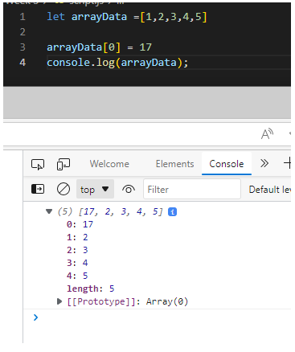

  - Properti array

    Array memiliki 5 properti yang sering digunakan yaitu :

    - constructor
    - length
    - index
    - input
    - prototype

    example:

    &nbsp;&nbsp;&nbsp;&nbsp;&nbsp;&nbsp;&nbsp;&nbsp;&nbsp;
    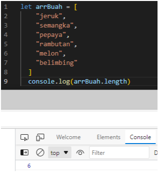

  - Method array

     - .push adalah method untuk menambahkan item array pada urutan yang paling akhir  
    ```
     let sayur = ['bayam', 'wortel', 'sawi'];
     sayur.push('kulbis')
     console.log(sayur) // output:['bayam', 'wortel', 'sawi','kulbis']
    ```
    - .pop adalah method yang menghapus item array index terakhir
    ``` 
     let sayur = ['bayam', 'wortel', 'sawi'];
     sayur.pop()
     console.log(sayur) // output: ['bayam', 'wortel']
    ```
    - .shift adalah method untuk menghapus item array pada index pertama 
    ``` 
     let sayur = ['bayam', 'wortel', 'sawi'];
     sayur.shift()
     console.log(sayur) // output: ['wortel', 'sawi']
    ```
    - .unshift adalah method untuk menambahkan array pada index pertama 
    ``` 
     let sayur = ['bayam', 'wortel', 'sawi'];
     sayur.unshift('tomat')
     console.log(sayur) // output:['tomat','bayam', 'wortel', 'sawi']
     ```

    - .splice adalah method untuk merubah data arraynya dan dapat mereturn nilai
    ``` 
    let arrBuah = [
    "jeruk", 
    "semangka", 
    "pepaya", 
    "rambutan",
    "melon",
    "belimbing"
     ]
     arrBuah.splice(2, 2, "buah naga")
     console.log(arrBuah) // output:['jeruk', 'semangka', 'buah naga', 'melon', 'belimbing']
     ``` 

    - .slice adalah method untuk ambil data dgn cara mengcopy
    ```
    let arrBuah = [
    "jeruk", 
    "semangka", 
    "pepaya", 
    "rambutan",
    "melon",
    "belimbing"
     ]
     arrBuah.splice(2, 2, "buah naga")
     console.log(arrBuah) // output:['jeruk', 'semangka', 'pepaya', 'rambutan', 'melon', 'belimbing']
     ``` 

  - Looping data

    untuk melakukan looping pada array ada .map dan .forEach
    - .forEach adalah method untuk melakukan looping pada setiap elemen array 
    example:

    &nbsp;&nbsp;&nbsp;&nbsp;&nbsp;&nbsp;&nbsp;&nbsp;&nbsp;
    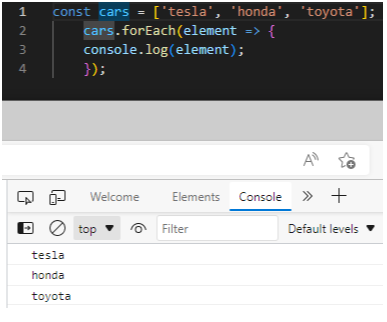

    - .map adalah method untuk melakukan perulangan dengan membuat array baru
    example:
    
    &nbsp;&nbsp;&nbsp;&nbsp;&nbsp;&nbsp;&nbsp;&nbsp;&nbsp;
    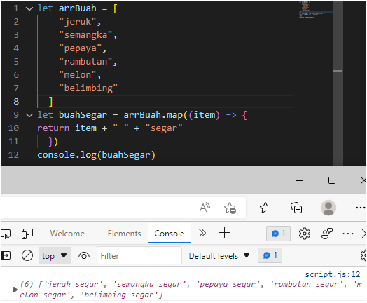

- ## Multidimensional array 

  <div align="justify">Bisa dianalogikan sebagai array of array. 

   - Multidimensional array sama seperti matriks yaitu memiliki 2 dimensi (x,y)

     ```
     let inventory = [
        ['Kaos Polos' , 10],
        ['Jaket' , 5],
        ['Topi' , 12],
        ['Celana' , 4],
     ];
     console.log(inventory);
     ```
  - Mengakses multidimensional array
     ```
    let inventory = [
        ['Kaos Polos' , 10],
        ['Jaket' , 5],
        ['Topi' , 12],
        ['Celana' , 4],
    ];
    console.log(inventory[1][0]);
    ```
- ## Javascript Object

  <div align="justify">object adalah sebuah tipe data pada variabel yang menyimpan properti dan fungsi (method). 

  <div align="justify">Properti adalah data lengkap dari sebuah object. Method adalah action dari sebuah object. Apa saja yang dapat dilakukan dari suatu object.

  - Membuat dan mengakses objek
    
    &nbsp;&nbsp;&nbsp;&nbsp;&nbsp;&nbsp;&nbsp;&nbsp;&nbsp;
    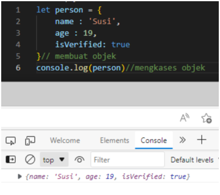

    Saat pemanggilan properti object dapat menggunakan bracket notation
    ```
    let person = {
        name : 'Susi',
        age : 19,
        'current address': 'Salatiga'
    }
    console.log(person['name'])
    ```

  - Menambah properti baru

    &nbsp;&nbsp;&nbsp;&nbsp;&nbsp;&nbsp;&nbsp;&nbsp;&nbsp;
    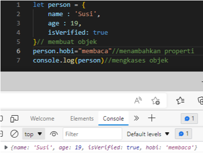

  - Mengganti nilai properti

    &nbsp;&nbsp;&nbsp;&nbsp;&nbsp;&nbsp;&nbsp;&nbsp;&nbsp;
    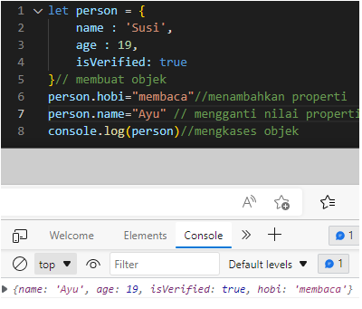

  - Delete object

    &nbsp;&nbsp;&nbsp;&nbsp;&nbsp;&nbsp;&nbsp;&nbsp;&nbsp;
    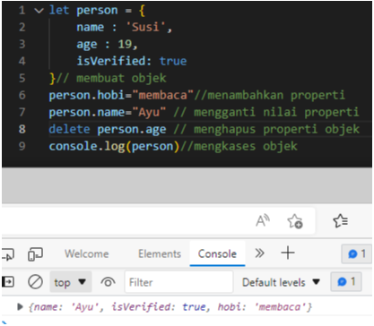

  - Method Object

    jika value yang dimasukkan pada properti berupa function.

    &nbsp;&nbsp;&nbsp;&nbsp;&nbsp;&nbsp;&nbsp;&nbsp;&nbsp;
    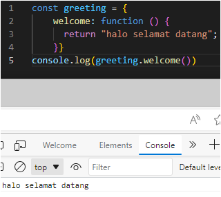

  - Nested Object

     &nbsp;&nbsp;&nbsp;&nbsp;&nbsp;&nbsp;&nbsp;&nbsp;&nbsp;
    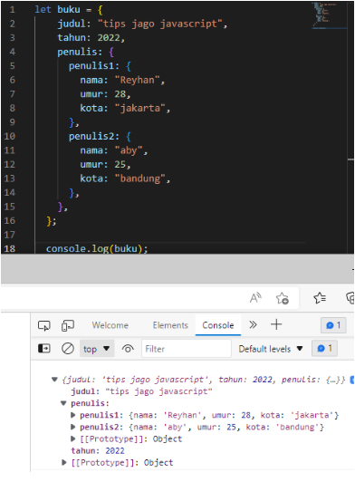

  - Loop object

    &nbsp;&nbsp;&nbsp;&nbsp;&nbsp;&nbsp;&nbsp;&nbsp;&nbsp;
    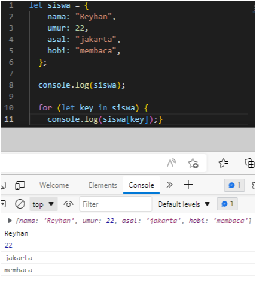

  - Array of object

    Membuat object di dalam array.

    &nbsp;&nbsp;&nbsp;&nbsp;&nbsp;&nbsp;&nbsp;&nbsp;&nbsp;
    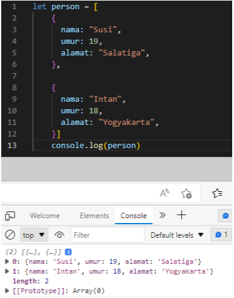

## JavaScript Recursive
- Recursive adalah fungsi yang memanggil dirinya sendiri sampai suatu kondisi tertentu terpenuhi
- A new paradigm :
  - Procedural
  - Conditional
  - Looping
  - Modular (function)
  - Recursive
- Ciri dari recursive:
  - Fungsi recursive memiliki kondisi yang menyatakan kapan fungsi tersebut berhenti. 
  - fungsi recursive selalu memaanggil dirinya sendiri sambil mengurangi atau memecahkan data masukan setiap panggilannya.
- Contoh mencari nilai pangkat 
    ```
    function pow(x,n) {
        if (n=1){
            return x;
        } else {
            return x * pow(x, n-1);
        }
    }
    console.log(pow(3,3)) // 9
    ```

## JavaScript Modules
   
   adalah cara untuk memisahkan kode ke file yang berbeda.

   - Keuntungan menggunakan modules

     - mudah untuk mengelola kode
     - kode tidak menumpuk di 1 file

  - Contoh 

    - index.html 

    ```
    <!DOCTYPE html>
    <html lang="en">
    <head>
       <meta charset="UTF-8">
       <meta http-equiv="X-UA-Compatible" content="IE=edge">
       <meta name="viewport" content="width=device-width, initial-scale=1.0">
       <title>Document</title>
    
    </head>
    <body>
        <script src="./indonesia.js" type="module"></script>
    </body>
    </html>
    ```

    - indonesia.js 

    ```
    import {apple} from './amerika.js';
    import {smartPhoneJepang} from './jepang.js';

    console.log(smartPhoneJepang);
    console.log(apple);
    ```

    - jepang.js 

    ```
    import {apple} from './amerika.js';
    console.log(apple);

    const smartPhone = ["sony", "samsung", "fujitsu", "LG"]
    let dokumenNegara = "Hello"
    export { dokumenNegara, smartPhone as smartPhoneJepang}
    ```

    - amerika.js 

    ```
    let apple = ["iphone", "macbook", "imac"]
    export {apple}
    ```

    - Output

    &nbsp;&nbsp;&nbsp;&nbsp;&nbsp;&nbsp;&nbsp;&nbsp;&nbsp;
    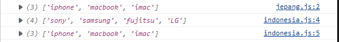


    
    


    

    


   


