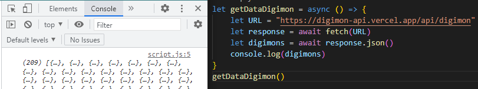
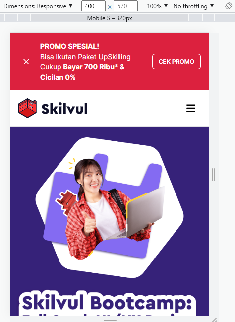
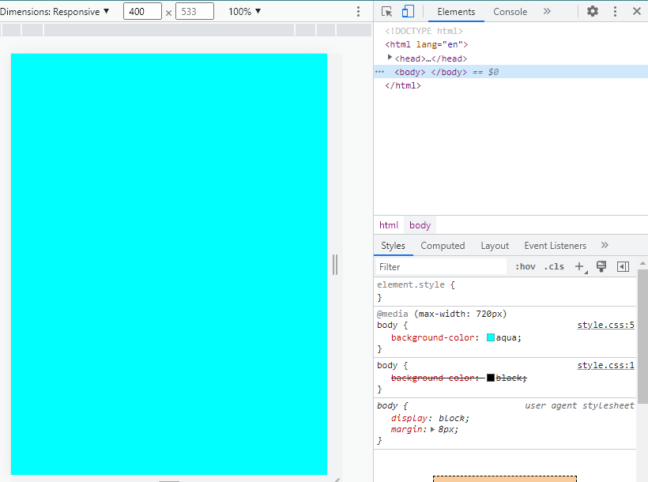
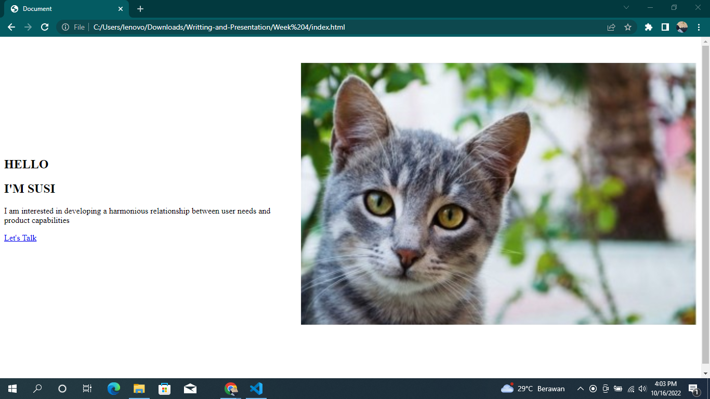

# Writing and Presentation Test Week 4

## JavaScript Intermediete
 - Asynchronus Await
   <div align="justify">adalah salah satu fitur baru dari javascript yang digunakan untuk menangani hasil dari sebuah Promise. Await berfungsi untuk menunda sebuah kode dijalankan sampai proses asynchronous berhasil.

  - HTTP Request fetch()
    <div align="justify">Fetch adalah native web API untuk melakukan HTTP calls dari external network.

  - Contoh function untuk mengambil data dari API menggunakan fetch(), Dengan Async Await

     &nbsp;&nbsp;&nbsp;&nbsp;&nbsp;&nbsp;&nbsp;&nbsp;&nbsp;
     
## Git dan Github
   Untuk menghindari conflict code yang dikembangkan. Kita tidak boleh berkolaborasi dalam project di satu branch yang sama

  - GIT log : untuk melihat history perubahan yang telah dilakukan pada suatu project
  - GIT Merge : untuk membuat branch yang bercabang menjadi satu kembali atau dengan kata lain mengintegrasikan kembali branch tersebut menjadi satu.
  - GIT checkout : untuk berpindah branch atau membuat branch baru
  - GIT reset : untuk merubah ke commit sebelumnya
  - GIT Revert : untuk membatalkan perubahan yang terjadi di git tanpa menghapus git commit sebelumnya
  - Clone yaitu menggandakan atau mengcopy sebuah project
  - Fork yaitu sama halnya dengan clone namun langsung mengambil file dari repository
## Responsive Web Design
   - Responsive Web Desin yaitu suatu tampilan website yang dapat menyesuikan dengan perangkat yang digunakan

   - Chrome Dev Tools merupakan tools pada google chrome yang digunakan sebagai tools Responsive Web Design

   - Shortcut untuk mengakses Chrome Dev Tools di windows yaitu CTRL + SHIFT + J

   - Contoh tampilan hasil shortcut:

   &nbsp;&nbsp;&nbsp;&nbsp;&nbsp;&nbsp;&nbsp;&nbsp;&nbsp;
   

   - Dalam menggunakan Responsive Web Design pada bagian HTML perlu ditambahkan viewport pada bagian head agar tampilan website dapat menyesuaikan dengan berbagai device

   ```
   <!DOCTYPE html>
   <html lang="en">
   <head>
      <meta charset="UTF-8">
      <meta http-equiv="X-UA-Compatible" content="IE=edge">
      <meta name="viewport" content="width=device-width, initial-scale=1.0">
      <title>Document</title>
      <script src="./script.js" defer></script>
   </head>
   <body>
    
   </body>
   </html>
   ```

   - Relative CSS Unit
     
     - %: Ukurannya relatif terhadap parent element
     - em: Ukurannya relatif terhadap font-size dari elemen saat ini
     - rem: Ukurannya relatif terhadap font-size root elemen (<html>). "rem" = "root em"
     - ch: Ukurannya mengikuti jumlah karakter (1 karakter sama dengan lebar dari karakter 0/nol font yang sedang aktif)
     - vh: Ukurannya relatif terhadap tinggi viewport (ukuran jendela tau aplikasi), 1vh = 1/100 dari tinggi viewport
     - vw: Ukurannya relatif terhadap lebar dari viewport. 1vw = 1/100 lebar viewport
     - vmin: Ukurannya relatif terhadap ukuran viewport yang lebih kecil (misalnya diorientasi portrait, lebar akan lebih kecil daripada tinggi). 1vmin = 1/100 dari ukuran viewport yang lebih kecil.
     - vmax: Sama dengan vmin, dia akan melihat ukuran viewport yang lebih besar
     - ex: Ukurannya relatif terhadap tinggi dari karakter "x" kecil font yang sedang aktif.

   - Untuk membuat suatu gambar pada halaman website agar menjadi responsive dapat dilakukan dengan menambahkan atribut Max - width = 100% pada bagian gambar
   
   - Media Query
     adalah salah satu cara untuk mengatur suatu website agar responsive di berbagai device.Perintah umum media query yang sering digunakan adalah min-width dan max-width.

      ```
     body{
       background-color: black;
     }
     @media(max-width:720px){
        body{
           background-color: aqua;
        }
      }

      ```

      &nbsp;&nbsp;&nbsp;&nbsp;&nbsp;&nbsp;&nbsp;&nbsp;&nbsp;
      
    

      Pada gambar di atas jika layar berada di ukuran lebar maksimal 720px maka body akan bewarna aqua jika ukuran melebihi 720px maka warna kembali ke setelan awal yaitu black.

      Perubahan tampilan pada saat pergantian device atau width disebut breakpoint.

- Flexbox dan Grid

    - Flexbox bertujuan untuk membuat website yang lebih efisien dalam mengatur, menata dan item pada dalam sebuah wadah bahkan ketika ukurannya tidak diketahui dan/atau dinamis (dengan menggunakan kata "flex").
    - Flexbox properties :
        - Flex direction : menetapkan sumbu utama item, sehingga menentukan arah item fleksibel ditempatkan di wadah fleksibel.
          1. Row : Kiri ke kanan
          2. Row-Reverse : Kanan ke kiri
          3. Column : Atas ke bawah
          4. Column-Reverse : Bawah ke atas
        - Flex Wrap : Secara default, semua item pada flexbox akan mencoba berada dalam satu baris. Maka dengan flex wrap kita dapat mengubah hal tersebut.
          1. nowrap : semua item flex akan berada dalam satu baris
          2. wrap : item fkex akan membungkus ke beberapa baris, dari atas ke bawah.
          3. wrap-reverse :item flex akan membungkus beberapa baris dari bawah ke atas.
        - Flex flow : cara singkat untuk properti flex-direction dan flex-wrap, yang bersama-sama menentukan sumbu utama dan sumbu silang container flex. Nilai default adalah baris nowrap.
        - Align items

    - Grid  
      Grid merupakan sistem tata letak berbasis dua dimensi.Pada Grid ada 2 jenis yaitu grid container dan grid item.

      ```
      .home{
         width: 100%;
         min-height: 90vh;
         display: grid;
         grid-template-columns: repeat(2,1fr);
         grid-gap:1.5rem;
         align-items: center;
         margin-bottom: 70px;
    
        }
      ```
      
      &nbsp;&nbsp;&nbsp;&nbsp;&nbsp;&nbsp;&nbsp;&nbsp;&nbsp;
      
## Bootstrap
- Bootstrap adalah salah satu framework opensource yang berfungsi membuat suatu responsive website
- Komponen utama bootstrap :
  - bootstrap.css
  - bootstrap.js
- Cara konfigurasi bootstrap :
  
  Membuat tag boostrap di head. Cara memanggil css bootstrap dengan menggunakan href lalu mengganti link href css lokal dengan link boostrap online.
- Contoh penggunaan content bootstrap :
  - CSS : bootstrap.min.css, bootstrap-grid.css, dll
  - JS : bootstrap.bundle.js, bootstrap.min.js, dll
- Komponen Bootstrap sebagian besar dibangun dengan base-modifier nomenclature.Contohnya mengelompokkan beberapa properti kedalam kelas dasar seperti .btn, seperti .btn-primary or .btn-success.
- Penggunaan theme color pada boostrap dapat menggunakan keyword berikut :
  ```
  $theme-colors: (
  "primary":    $primary,
  "secondary":  $secondary,
  "success":    $success,
  "info":       $info,
  "warning":    $warning,
  "danger":     $danger,
  "light":      $light,
  "dark":       $dark
  );
  ```

- Kapan kita menggunakan bootstrap?

  Boostrap digunakan ketika membuat website sederhana dan tidak memerlukan load lama
- Layout pada boostrap :

  Breakpoints merupakan suatu cara yang dilakukan untuk membuat desain responsif dengan mengontrol kapan tata letak yang disesuaikan dengan ukuran perangkat tertentu.
    - Breakpoints pada bootstrap ada 5 yaitu sm, md, lg, xl dan xxl.
    - Setiap breakpoint dipilih untuk menampung container yang lebarnya   12 dengan sehingga tersusun rapi. Breakpoint juga mewakili subset ukuran perangkat umum dan dimensi area pandang.
 - Container adalah blok dasar atau pembungkus boostrap yang terdiri dari contain, pad dan align  yang menyelaraskan konten website dalam perangkat atau area pandang tertentu.Terdapat 3 container pada boostrap yaitu :
    - .container, yang menerapkan lebar maksimum pada setiap breakpoint responsif
    - .container-{breakpoint}, menerapkan lebar 100% sampai dengan breakpoint yang ditentukan.
    - .container-fluid, menerapkan 100% ukurannya dari breakpoints
 - Grid System pada bootstrap yang terdiri dari 12 kolom default.
 - Grid system pada bootstrap menggunakan container,baris dan kolom untuk menata dan menyelaraskan konten,yang dibangun menggunakan flexbox dan itu sudah responsive.
 
  - contoh penggunaan grid system
   ``` 
     <div class="container text-center">
     <div class="row">
      <div class="col">
        Column
      </div>
      <div class="col">
        Column
      </div>
      <div class="col">
        Column
      </div>
     </div>
     </div>
   ```
- Grid system bootstrap :
  - .col-lg digunakan untuk mengatur grid pada ukuran monitor yang besar
  - .col-md digunakan pada monitor komputer berukuran sedang
  - .col-sm digunakan untuk mengatur monitor pada tablet
  - .col-xs digunakan untuk mengatur monitor pada handphone 

      


  


   


