# Ringkasan Week 5

## Day 1 Web Server dan Restful Api


- <div align="justify">Web server adalah gabungan antara hardware dan software yang digunakan untuk menampung website.

- Static Web Server VS Dynamic Web Server
  <div align="justify">Server web statis, atau tumpukan, terdiri dari komputer (perangkat keras) dengan server HTTP (perangkat lunak). Disebut "statis" karena server mengirimkan file yang dihosting apa adanya ke browser. Sedangkan Sebuah server web dinamis terdiri dari server web statis ditambah perangkat lunak tambahan, paling sering server aplikasi dan database. Disebut "dinamis" karena server aplikasi memperbarui file yang dihosting sebelum mengirim konten ke browser melalui server HTTP.

- Web Server Side
  <div align="justify">menunggu pesan permintaan klien, memprosesnya saat tiba, dan membalas browser web dengan pesan respons HTTP. Respons berisi baris status yang menunjukkan apakah permintaan berhasil atau tidak (mis. "HTTP/1.1 200 OK" untuk berhasil).

  Isi respons yang berhasil atas permintaan akan berisi sumber daya yang diminta (misalnya halaman HTML baru, atau gambar, dll...), yang kemudian dapat ditampilkan oleh browser web.

  Web server side terdiri dari 2 bagian :

  - Static side adalah situs yang mengembalikan konten hard-coded yang sama dari server setiap kali sumber daya tertentu diminta

  - Dynamic side adalah situs di mana beberapa konten respons dihasilkan secara dinamis, hanya bila diperlukan.

  Perbedaan dari Static and Dynamic Site :
  1. Mereka memiliki tujuan dan fokus yang berbeda.
  2. Mereka umumnya tidak menggunakan bahasa pemrograman yang sama (pengecualiannya adalah JavaScript, yang dapat digunakan di sisi server dan klien).
  3. Mereka berjalan di dalam lingkungan sistem operasi yang berbeda.

- Pengertian Rest
  
  <div align="justify">REST, atau Representational State Transfer, adalah gaya arsitektur untuk menyediakan standar antara sistem komputer di web, sehingga memudahkan sistem untuk berkomunikasi satu sama lain.

  Sistem yang sesuai dengan REST, sering disebut sistem __RESTful__ , dicirikan oleh bagaimana mereka tidak memiliki kewarganegaraan dan memisahkan masalah klien dan server

- Kata kerja HTTP
  <div align="justify">Ada 4 kata kerja HTTP dasar yang biasanya sering digunakan dalam permintaan untuk berinteraksi dengan sumber daya dalam sistem REST:

  - GET — mengambil sumber daya tertentu (berdasarkan id) atau kumpulan sumber daya
  - POST — buat sumber daya baru
  - PUT — perbarui sumber daya tertentu (berdasarkan id)
  - DELETE — menghapus sumber daya tertentu dengan id

- Headers and Accept Parameters

  <div align="justify">Di header permintaan, klien mengirimkan jenis konten yang dapat diterimanya dari server.

- Paths
  
  <div align="justify">Permintaan harus berisi jalur ke sumber daya tempat operasi harus dilakukan. Dalam RESTful API, jalur harus dirancang untuk membantu klien mengetahui apa yang sedang terjadi.

- Response code

  <div align="justify">Tanggapan dari server berisi kode status untuk memperingatkan klien tentang informasi tentang keberhasilan operasi. 
  Untuk setiap kata kerja HTTP, ada kode status yang diharapkan yang harus dikembalikan server setelah berhasil:

  - GET — kembalikan 200 (OK)
  - POST — kembalikan 201 (DIBUAT)
  - PUT — kembalikan 200 (OK)
  - DELETE — return 204 (NO CONTENT) 

  <div align="justify">Jika operasi gagal, kembalikan kode status paling spesifik yang mungkin terkait dengan masalah yang ditemui.

## Day 2 Intro Node Js

- <div align="justify">Node Js adalah lingkungan runtime JavaScript open-source, lintas platform, back-end yang berjalan pada mesin V8 dan mengeksekusi kode JavaScript di luar browser web.

- Node JS Architecture
  Arsitektur di Node js antara lain :
  - Single Thread : hanya memiliki satu tumpukan panggilan yang digunakan untuk menjalankan program.
  - Event Loop : memeriksa terus menerus, ketika antrian kosong di call stack maka akan menambah antrian baru dari event queue sampai semua perintah selesai di eksekusi.
  - Server side scripting : kita dapat menjalankan javascript di server side menggunakan terminal command line menggunakan perintah “node”. 

- Built in Module Node Js
  1. Console
     <div align="justify">Console merupakan module bawaan dari javascript yang ada di node JS untuk digunakan sebagai debug atau menampilkan code secara interface.

     Example :

     &nbsp;&nbsp;&nbsp;&nbsp;&nbsp;&nbsp;&nbsp;&nbsp;&nbsp;
     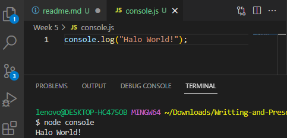

   2. Process
      <div align="justify">Process adalah modules yang digunakan untuk menampilkan dan mengontrol prosess Node JS yang sedang dijalankan.

      Example :

      &nbsp;&nbsp;&nbsp;&nbsp;&nbsp;&nbsp;&nbsp;&nbsp;&nbsp;
      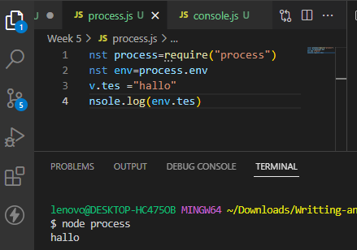

   3. OS

      <div align="justify">OS module merupakan module yang digunakan untuk menyediakan informasi terkait sistem operasi komputer yang digunakan user.

      Example :

      &nbsp;&nbsp;&nbsp;&nbsp;&nbsp;&nbsp;&nbsp;&nbsp;&nbsp;
      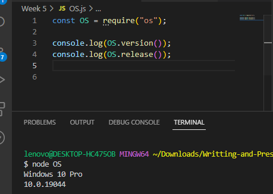

   4. util

      Module Util merupakan alat bantu / utilities untuk mendukung kebutuhan internal API di Node JS


      Example :

      &nbsp;&nbsp;&nbsp;&nbsp;&nbsp;&nbsp;&nbsp;&nbsp;&nbsp;
      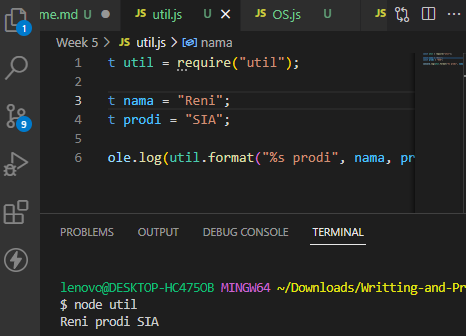

   5. fs

      <div align="justify">Fs atau “file system” merupakan module yang dapat membantu berinteraksi dengan file yang ada diluar code. FS paling sering digunakan untuk membaca file dengan ekstensi .txt, .csv, dan .json


      Example :

      &nbsp;&nbsp;&nbsp;&nbsp;&nbsp;&nbsp;&nbsp;&nbsp;&nbsp;
      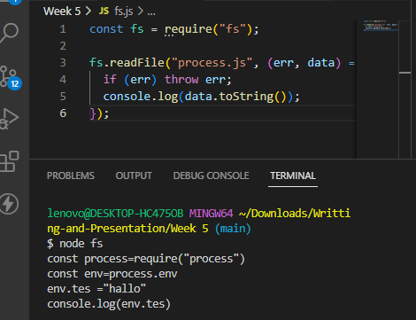

   6. events

     
      &nbsp;&nbsp;&nbsp;&nbsp;&nbsp;&nbsp;&nbsp;&nbsp;&nbsp;
      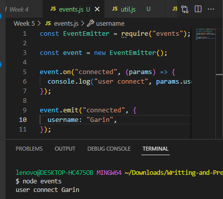


- Membuat Web server dengan node js
  
  <div align="justify">Node.js memiliki built-in modul yang disebut HTTP, built-in modul ini memungkinkan Node JS mentransfer data melalui Hyper Text Transfer Protocol (HTTP).
  
  - Untuk menggunakan modul HTTP, gunakan require()

  - Gunakan method createServer() untuk membuat server HTTP

  - Callback function yang digunakan pada method http.createServer(), akan dijalankan ketika seseorang mencoba mengakses komputer pada port 8080.

   &nbsp;&nbsp;&nbsp;&nbsp;&nbsp;&nbsp;&nbsp;&nbsp;&nbsp;
   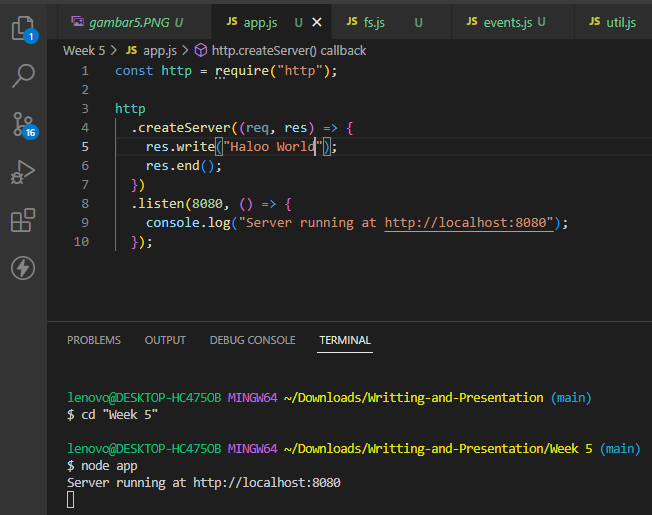

   Output:

   &nbsp;&nbsp;&nbsp;&nbsp;&nbsp;&nbsp;&nbsp;&nbsp;&nbsp;
   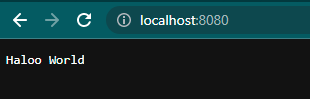


## Day 3 Express Routing dan Middlewere

 - Express adalah Express.js, atau hanya Express, adalah kerangka aplikasi web back end untuk Node.js, dirilis sebagai perangkat lunak sumber terbuka dan gratis di bawah Lisensi MIT. Ini dirancang untuk membangun aplikasi web dan API. Ini telah disebut sebagai kerangka kerja server standar de facto untuk Node.js.

- Routes adalah sebuah end point yang diapat kita akses menggunakan URL di website. Didalam routes kita perlu menentukan method API, alamat dan response apa saja yang akan dikeluarkan.
- Method

  Kita dapat menggunakan method yang dalam REST API seperti POST, PUT, PATCH dan DELETE
- Response

  Di dalam route kita dapat mengirim response menggunakan parameter dari route express.js yaitu “res.Send()” untuk mengirim plain text ketika kita mengakses route tersebut. 

- Status Code

  Dalam pengaplikasian back end application, kita sangat perlu memberikan status code sebagai informasi apakah route yang kita akses berjalan sebagaimana mestinya dan tidak terjadi error.

- Query

  Query merupakan parameter yang digunakan untuk membantu menentukan tindakan yang lebih spesifik daripada hanya sekedar router biasa.

- Nested route

  Nested route digunakan ketika terdapat banyak route yang memiliki nama yang sama atau ingin membuat route yang lebih mendalam

  Syntax basic :

  &nbsp;&nbsp;&nbsp;&nbsp;&nbsp;&nbsp;&nbsp;&nbsp;&nbsp;
  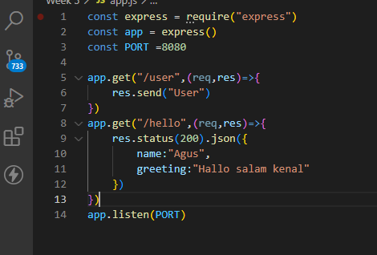

- Middleware function adalah sebuah fungsi yang memiliki akses ke object request (req), object response (res), dan sebuah fungsi next didalam request-response cycle.
- Fungsi next biasanya di berikan nama variable next.
- Pada Dasarnya, sebuah middleware function dapat melakukan tugas-tugas berikut :
  - Menjalankan kode apapun.
  - Memodifikasi Object Request dan Object Response.
  - Menghentikan request-response cycle.
  - Melanjutkan ke middleware function selanjutnya atau   ke handler function dalam suatu request response cycle.

- Jenis Express Middleware Berdasarkan Cara Penggunaan

  Express Middleware dapat dikelompokkan berdasarkan dari dimana middleware function itu digunakan :

  - Application Level Middleware

    Application Level Middleware adalah sebuh function middleware yang melekat ke instance object Application Express.Penggunaannya dengan cara memanggil method app.use().Application Level Middleware akan di jalankan setiap kali Express Application menerima sebuah HTTP Request.

  - Router Level Middleware
    Router Level Middleware adalah sebuh function middleware yang cara kerjanya sama persis dengan application level middleware, yang menjadikan perbedaan adalah middleware function ini melekat ke instance object Router Express.
    Penggunaannyadengan cara memanggil method express.Router().

   
  - Error Handling Middleware

  Error Handling mengacu kepada bagaimana cara sebuah Express Application menangkap dan memproses error yang terjadi, baik itu berupa kesalahan yang synchronous maupun asynchronous.
  
  Error Handling Middleware digunakan pada Application Level Middleware

Example :
```
const express = require('express')
const app = express()
const router = express.Router()

// application level middleware
app.use((req, res, next) => {
  // There is no specified mount path. It will execute every time this app receives a request.
  console.log("My first middleware function!")
  res.send("Method type: " + req.method)
})

// router level middleware
router.use('/:id', (req, res, next) => {
  // Printing the type of request for the specified id 
  console.log(req.method)
  next()
})

// error handling middleware
app.use((err, req, res, next) => {
  // Sending an error message as a response to a 400 error
  res.status(400).send(err.message)
})
```

- Jenis Express Middleware Berdasarkan Source Middleware Function : 
  - express.static()
  - express.json()
  - express.urlEncoded()


## Day 4 Design Database with MySQL 

- Entity Relationship Mode -> Mendesign database berdasarkan objek/pelaku.
- contoh : User dapat mengikuti matakuliah. (Pengerjaan sesuai problem yang ada)

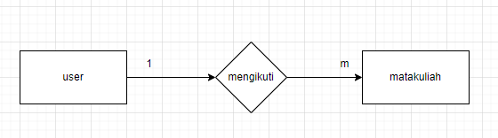

- Pembacaan gambar diatas adalah satu user dapat mengikuti banyak matakuliah.
- Maka relasi yang dimiliki adalah 0ne to many.
- kemudian Dosen mengajar matakuliah.

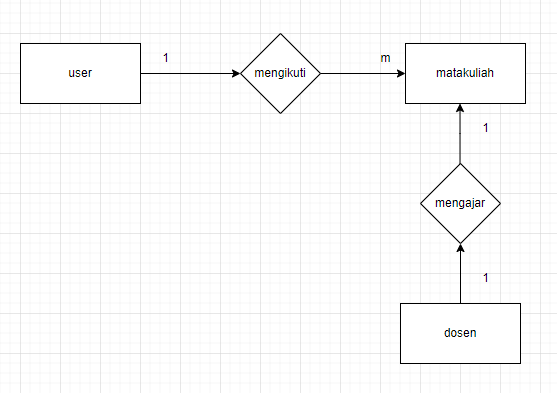

- Satu dosen mengajar 1 matakuliah. Maka relasi yang dimiliki one to one.
- Relasi :
    - 1:1 ( one to one)
    - 1:m (one to many) / m:1 (many to one)
    - m:m (many to many)
- Satu matakuliah dapat diikuti banyak user maka relasi menjadi many to many.
- Jika relasi many to many maka ada tambahan entity baru.

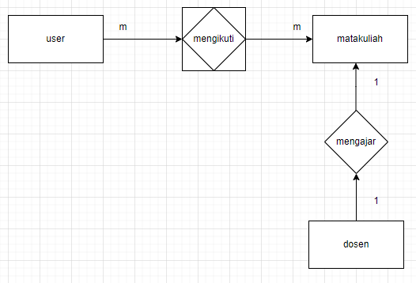

- Matakuliah menempati ruangan.
- Relasinya satu ruangan dapat ditempati banyak matakuliah (one to many).

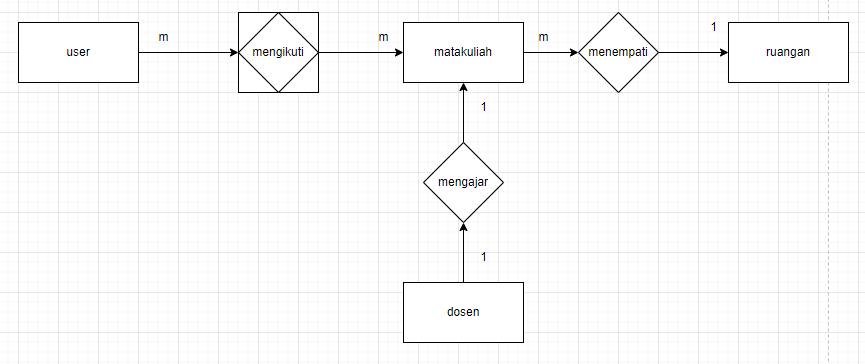

- Setiap entity memiliki atribut.

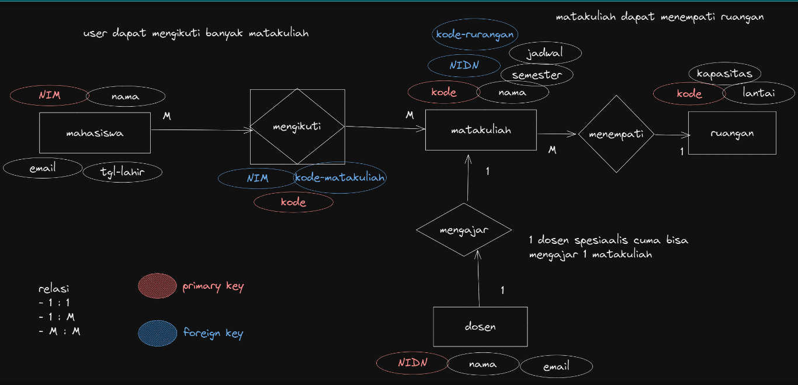

- Setiap entity memiliki 1 atribut utama sebagai primary key. 
- Primary key wajib unix dan hanya dimiliki 1 entity. (example : Setiap mahasiswa memiliki NIM yang berbeda dengan mahasiswa lainnya).
- Foreign key merupakan primary key dari entitas lain. (Contoh gambar diatas NIDN merupakan Primary key dari entitas dosen dan juga atribut pada entity matakuliah maka di entity matakuliah disebut sebagai foreign key).

- ERD (Entity Relationship Diagram).
- Dari model diatas dibuat ERD seperti dibawah ini.

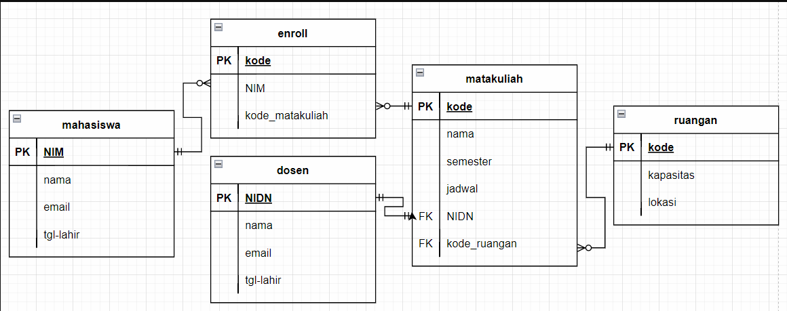

- Setiap tabel dihubungkan dengan atribut yang sama. 
- Penghubung dilakukan sesuai relasi yang sudah dibuat pada model diatas.

## Day 5 Design Database with MySQL

- Problem : Mahasiswa dapat menyukai lebih dari 1 film tiap film memiliki informasi terkait genre tiap film dapat memiliki banyak genre.

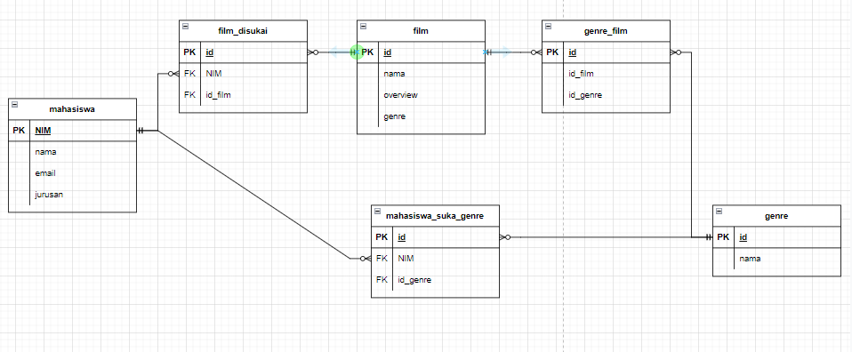

- Design database memudahkan untuk mengaplikasikan ketika di sql.
- Normalisasi, teknik supaya data terorganisir agar data tidak terjadi anomali,redundant dan mudah untuk dicari.
- Dilakukan ketika mendesign database dari kumpulan data, design database kurang bagus dan masih terjadi anomali.
- Sebelumnya siapkan data UNF atau belum normal.

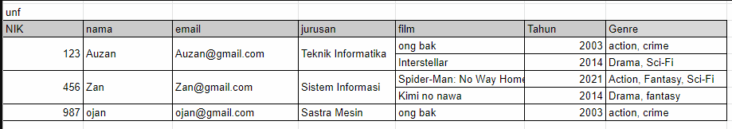

- Tahap selanjutnya yaitu 1NF
  - 1NF memiliki peraturan berupa :
    - tidak ada urutan dalam penyimpanan data.
    - harus menggunakan tipa data yang sama pada 1 kolom.
    - harus ada primary key.
    - tiap kolom harus berisi nilai tunggal.


- 2NF :
    - harus dalam bentuk 1NF.
    - tidak ada partial dependency. (atribut yang tidak ada hubungan dengan primary key akan dipisah)

- 3NF :
    - harus dalam bentuk 2NF
    - tidak ada transitif depdency. (setiap atribut harus bergantung pada primary key supaya tidak terjadi transitif depedency)

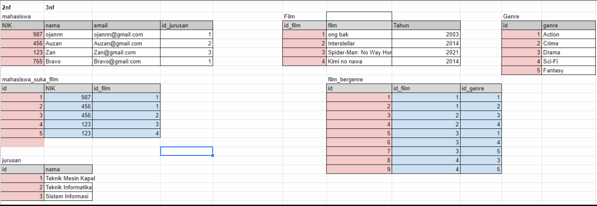


