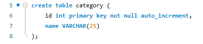
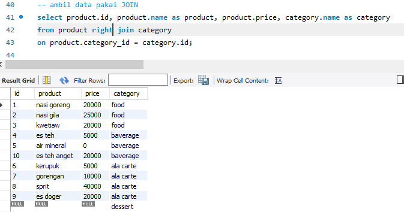

# Ringkasan Week 6

## DAY 1 MYSQL Basic

- Database merupakan sekumpulan tabel yang berisikan informasi untuk diolah yang kemudian data tersebut bisa digunakan di dalam sebuah sistem.
- DBMS adalah software yang dapat digunakan oleh user untuk berkomunikasi dengan data yang ada dalam media penyimpanan.
- MySQL adalah sistem manajemen basis data relasional open source berbasis SQL.
- Data type SQL
  - Number: Tipe data Number adalah data yang berisi kumpulan karakter angka
  - String: Tipe data string adalah tipe data berupa kumpulan karakter termasuk karakter simbol
  - boolean: Tipe ini hanya menyimpan 2 tipe data yaitu TRUE dan FALSE, dan dapat di convert menjadi int dengan representasi TRUE = 1, dan FALSE = 0
  - Date Time: Tipe ini merupakan tipe data untuk menyimpan tanggal dan waktu
  - Default: Tipe data untuk set default value jika tidak di assign dengan value
  - Null: Tipe data kosong atau tipe data yang belum di assign dengan value / data
- SQL Command
  - create database nama_database: digunakan untuk membuat database baru
  - show database: untuk menunjukkan seluruh list database di mysql kita
  - use database: digunakan untuk menggunakan database yang sudah ada
  - drop database nama_database: digunakan untuk menghapus / menghilangkan database yang dipilih dari MySQL kita

  - DDL (Data Definition Language)

    DDL merupakan kumpulan perintah SQL yang digunakan untuk membuat, mengubah dan menghapus struktur dan definisi metadata dari objek-objek Database.

    - command untuk membuat tabel baru di database.Saya membuat tabel category di database store1 :

     

    - command untuk menghapus table yang diinginkan jika ingin dihapus:

    

    - command untuk menambah atau menghilangkap kolom di table yang dipilih:

    
    
  - DML (Data Manipulation Language)
    
    - command untuk menambahkan data ke tabel:

    

    - command untuk menampilkan beberapa kolom yang ingin dilihat dari tabel :

    

    - command digunakan untuk mencari data dengan kondisi tertentu:

     

    - Command UPDATE digunakan untuk melakukan perbaruan data di table.

    
    
     - Command DELETE digunakan untuk melakukan penghapusan data

    

   - DCL (Data Control Language)

     - GRANT: digunakan untuk memberikan hak akses pada user.
     - REVOKE digunakan untuk mencabut hak akses yang telah diberikan pada user.


## DAY 2 MYSQL Lanjutan

-  Tipe-tipe relations pada MySQL :
   1. <div align="justify">One to Many : Satu baris dalam tabel dapat memiliki beberapa baris di table relasinya.
   2. <div align="justify">Many to many : Digunakan ketika kedua tabel yang berelasi dapat memiliki beberapa baris di tabel relasinya.
   3. <div align="justify">One to one : Diimplementasikan dengan cara yang sama seperti One to Many tetapi dengan kondisi tambahan (foreign key merupakan primary key).

-  Normalisasi

   <div align="justify">Merupakan teknik analisis data yang mengorganisasikan atribut-atribut data dengan cara mengelompokkan sehingga terbentuk entitas yang non-redundant, stabil, dan fleksible.

   Bentuk Database Normalization : 
   - First Normal Form (1NF): Menghilangkan multiple value pada sebuah kolom table database.
   - Second Normal Form (2NF): Menghapus beberapa subset data yang ada pada tabel dan menempatkan mereka pada tabel terpisah.Harus sudah dalam bentuk 1NF untuk mendapatkan 2NF.
   - Third Normal Form (3NF): Menghilangkan seluruh atribut atau field yang tidak berhubungan dengan primary key. Dengan demikian tidak ada ketergantungan transitif pada setiap kandidat key.

 - Key di SQL : 

   - Primary key : kumpulan satu atau lebih fields/columns dari sebuah tabel yang secara unik mengidentifikasi sebuah record dalam tabel database.
   - foreign key : Field di sebuah table database yang menjadi Primary Key di table database lain.
   - Unique Key : Hampir sama dengan Primary key, namun value dari Unique Key bisa berupa satu buah null value di dalam sebuah table database, dan Unique Key tidak bisa memiliki duplicate values.

  - Join Multiple Tables

    <div align="justify">Mengambil records dari dua atau lebih table database yang memiliki relationship dan akan di sajikan dalam single result set.
    
    1. __Inner join__

       <div align="justify">Semua baris akan diambil dari kedua table yang akan di JOIN, selama columns cocok dengan kondisi yang sudah di tentukan.
       <div align="justify">Memungkinkan baris dari salah satu tabel muncul di hasil jika dan hanya jika kedua tabel memenuhi kondisi yang ditentukan dalam klausa ON.

       

    2. __Left join__

       <div align="justify">Pada JOIN ini, semua records dari table di sisi kiri JOIN statement akan di pilih.
       <div align="justify">Jika record yang di pilih dari table kiri tidak memiliki record yang cocok pada table JOIN yang kanan, maka record tersebut masih dipilih, dan kolom pada table yang kanan akan bernilai NULL. 

       

    3. __Right join__
    
       Pada JOIN ini, semua records dari table di sisi kiri JOIN statement akan di pilih, bahkan jika table di sebelah kiri tidak memiliki record yang cocok.
       
       

  - Aggregate Functions

    - MAX : fungsi mengembalikan nilai terbesar dari kolom yang dipilih.

      

    - MIN : fungsi mengembalikan nilai terkecil dari kolom yang dipilih.

      

    - SUM : fungsi mengembalikan jumlah total kolom numerik.

      

    - COUNT : fungsi mengembalikan jumlah baris yang cocok dengan kriteria yang ditentukan.

      

    - AVG : fungsi mengembalikan nilai rata-rata kolom numerik.

      

  - Union
    - Digunakan untuk menggabungkan kumpulan hasil dari dua atau lebih pernyataan SELECT.
    - Setiap pernyataan SELECT dalam UNION harus memiliki jumlah kolom yang sama
    - Kolom juga harus memiliki tipe data yang serupa
    - Kolom dalam setiap pernyataan SELECT juga harus dalam urutan yang sama

  - Group By
    - Mengelompokkan baris yang memiliki nilai yang sama ke dalam baris ringkasan
    - Sering digunakan dengan fungsi agregat untuk mengelompokkan kumpulan hasil dengan satu atau lebih kolom.

  - Having

    <div align="justify">HAVING ditambahkan ke SQL karena kata kunci WHERE tidak dapat digunakan dengan aggregate functions.

  - Like & Wildcards
    - Operator LIKE digunakan dalam klausa WHERE untuk mencari pola tertentu dalam kolom.
    - Karakter wildcard digunakan untuk menggantikan satu atau lebih karakter dalam sebuah string.

## DAY 3 Authentication &Authorization in Express

- <div align="justify">Otentikasi bergantung pada satu atau lebih faktor untuk memverifikasi identitas, dan faktor-faktor ini datang dalam tiga jenis utama:

  - Pengetahuan yang Anda ketahui, seperti nama pengguna dan kata sandi.
  - Kepemilikan yang Anda miliki, seperti kartu keamanan atau perangkat seluler
  - Inheren sesuatu tentang Anda, yang umumnya mengacu pada data biometrik seperti sidik jari.

- otorisasi adalah verifikasi atas apa yang boleh Anda lakukan.

  <div align="justify">setelah penjaga keamanan telah mengautentikasi , kemudian berikan tiket pengguna ke penjaga keamanan lain yang kemudian hanya mengizinkan pengguna untuk masuk ke Penerimaan Umum (bukan bagian VIP).
  Salah satu alat inti untuk menegakkan otentikasi dan otorisasi adalah enkripsi. 
 
- <div align="justify">Enkripsi adalah proses mengubah data menjadi format yang tidak dapat dibaca kecuali pengguna memiliki kunci yang benar untuk mendekripsinya. Enkripsi datang dalam dua jenis utama:

  - Enkripsi simetris
  - Enkripsi asimetris

- Session VS Cookie VS LocalStorage

  
  - Web session

  <div align="justify">Sesi web mengacu pada serangkaian interaksi pengguna selama jangka waktu tertentu. Data sesi disimpan di sisi server dan dikaitkan dengan ID sesi.
  - Session & Cookie
  <div align="justify">Agak kikuk bagi klien untuk mengingat untuk menempelkan ID sesi ke setiap permintaan. Karena itu, ID sesi sering disimpan di sisi klien dalam bentuk cookie sesi.
- Cookie Security

  <div align="justify">Langkah pertama untuk mengamankan cookie adalah dengan menambahkan tanggal kedaluwarsa atau durasi sehingga cookie tidak bertahan lebih lama dari yang seharusnya.

- Token Based Authentication using JWT

  <div align="justify">Token Web JSON adalah objek JSON mandiri yang secara kompak dan aman mengirimkan informasi antara dua pihak.

  <div align="justify">Objek JSON harus diapit kurung kurawal dan dapat berisi satu atau lebih pasangan nilai kunci.

- Komponen JWT

  JWT terdiri dari tiga komponen:

  - Header
  - Payload
  - Signature

- JWT Header

  <div align="justify">Header JWT berisi jenis token yang kami buat dan algoritma penandatanganan yang akan digunakan.

  <div align="justify">Jenis: Jenis token ini akan selalu "JWT". Internet Assigned Numbers Authority, atau IANA, mengoordinasikan sumber daya protokol internet di seluruh dunia. Jenis "JWT" sejajar dengan jenis media "application/jwt".

- JWT Payload

  <div align="justify">Payload JWT berisi klaim tentang suatu entitas. Klaim adalah pernyataan atau informasi dan entitas sering kali adalah pengguna.

- JWT Signature

  <div align="justify">Tanda tangan JWT digunakan untuk memverifikasi bahwa JWT tidak dirusak atau diubah. Itu dapat dibuat dengan mengambil tajuk yang disandikan, muatan yang disandikan, rahasia, dan menggunakan algoritma hashing untuk membuat hash dari elemen-elemen itu. Rahasianya adalah kunci simetris yang diketahui oleh pengirim dan penerima token ini.
## DAY 5 Sequelize Intro

- <div align="justify">Sequelize adalah ORM (Object Relational Mapping) Node JS yang berbasis promise. Sequelize mendukung sebagian besar relational Database seperti MySQL, PostgresQL, MariaDB, SQLite dan Miscrosoft SQL Server.

  <div align="justify">ORM adalah suatu metode/teknik pemrograman yang digunakan untuk mengkonversi data dari lingkungan bahasa pemrograman berorientasi objek (OOP) dengan lingkungan database relational.  

- install sequelize cli globally

  ```bash
  npm i -g sequelize-cli
  ```


- install in local project

  ```bash
  npm install sequelize
  ```

- install mysql driver

  ```bash
  npm install mysql2
  ```

- init sequelize in local project

  ```bash
  npx sequelize-cli init
  ```

  <br>

> **_Note:_**
> Perhatikan config di folder config. pastikan data sama dengan database yang sudah dibuat.

<br>

- create model

  ```bash
  npx sequelize-cli model:generate --name User --attributes email:string,password:string
  ```

- migrate

  ```bash
  npx sequelize-cli db:migrate
  ```


  


   


    


    

    


   

   
