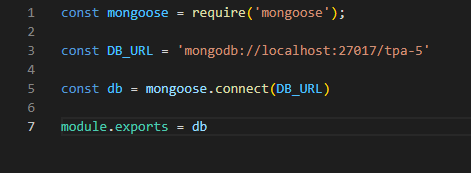
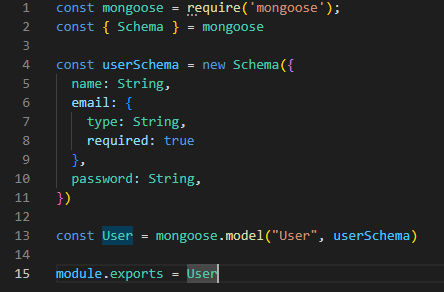
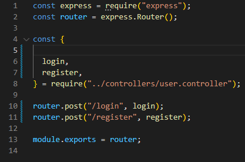
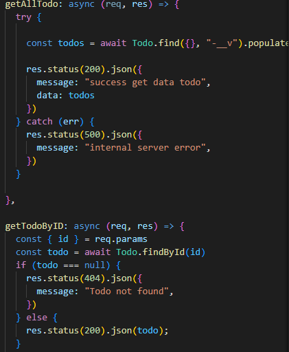
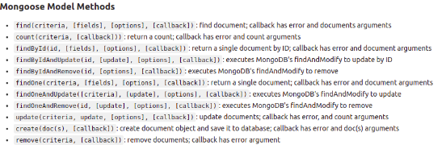
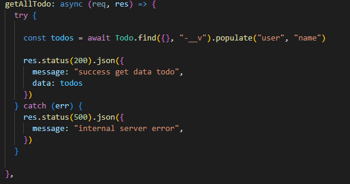

# Ringkasan Week 7

## Day 3 Mongoose

- Pengertian Mongoose

  Mongoose adalah library yang bisa dibilang sebagai Object Modelling MongoDB untuk NodeJS.Mongoose bisa digunakan untuk mengelola hubungan antara data, menyediakan validasi.Dan juga digunakan untuk menerjemahkan antara objek dalam kode dan representasi Objek tersebut di MongoDB.

- Install Mongoose
  
  Untuk menggunakan mongoose,kita perlu menginstallnya terlebih dahulu :

  ```bash
  npx install mongoose
  ```

- Create connection 
  Membuat koneksi dengan menggunakan MongoDB database

  

- Defining schema

  kita mendefine Skema, dan tipe data untuk setiap field yang akan digunakan.kita menggunakan model users dari schema yang telah kita buat untuk melakukan pengolahan data, atau operasi CRUD.

  
  

- Membuat CRUD sederhana

  - install express
    
    ```bash
    npx install express
    ```
  
  - Buat endpoint
    
    

  - Buat controller
    
    Kita bisa menggunakan method yang sudah disediakan mngoose untuk mengolah data.

    .

    Method-method di mongoose :
    
    .

- Populate
  
  Populate adalah proses penggabungan 2 collection atau lebih menjadi satu objek JSON.
  
  Contoh penggunaan :

  .

  Pada gambar di atas kita melakukan populate dari schema user.Sehingga pada saat menambahkan todo yang didalamnya terdapat id user,maka web server juga akan memanggil nama pemilik dari id tersebut.

## Day 4 Docker

- Pengertian Docker

  Docker adalah software yang menjalankan suatu aplikasi menggunakan container. Docker berfungsi sebagai penyedia layanan virtual bagi aplikasi yg diinstall pada sebuah host. 

- Container vs Virtual Machine

  VM memakan banyak resource dan waktu utk booting karena melakukan virtualisasi pada host hardware-nya. 

  Sedangkan container kebalikannya dari vm, container melakukan virtualisasi pada host OS-nya.

- Perintah dasar docker
  
  - docker pull

    Download image dari docker hub

    ```bash
    docker pull chuanwen/cowsay
    ```

  - docker images

     Melihat kumpulan images yang sudah terdownload

    ```bash
    docker images
    ```

  - docker run

    Menjalankan container

    ```bash
    docker run chuanwen/cowsay
    ```

  - docker ps
  
    Melihat container yang berjalan


    ```bash
    docker ps
    ```

 


    


   
